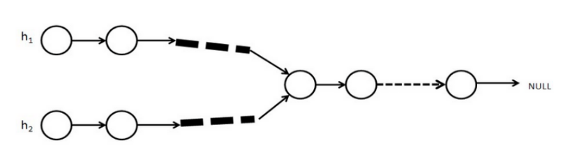
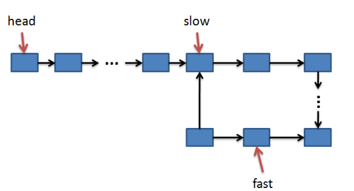
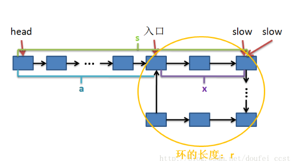

#每日一练
* [1. 字典序](#1-字典序)
* [2. 卖买股票的最大收益](#2-卖买股票的最大收益)
* [3. 卖买股票的最佳时机](#3-卖买股票的最佳时机)
* [4. 找出单独出现的数字](#4-找出单独出现的数字)
* [5.幸运数字](#5-幸运数字)
* [6.句子反转](#6-句子反转)
* [7.整数反转](#7-整数反转)
* [8.字符串反转](#8-字符串反转)
* [9.数字反转](#9-数字反转)
* [10.url反转](#10-url反转)
* [11.牌子顺序](#11-牌子顺序)
* [12.替换空格](#12-替换空格)
* [13.twosum](#13-twosum)
* [14.写一个全排列](#14-写一个全排列)
* [15.判断两个单链表是否相交及找到第一个交点](#15-判断两个单链表是否相交及找到第一个交点)
* [16.怎么判断链表有环，怎么找到环入口](#16-怎么判断链表有环怎么找到环入口)
* [17.用两个栈实现队列](#17-用两个栈实现队列)
* [18.用两个队列实现栈](#18-用两个队列实现栈)
* [19.第一个出现重复的字符](#19-第一个出现重复的字符)
* [20.单链表反转](#20-单链表反转)
# 1. 字典序
给定整数n和m, 将1到n的这n个整数按字典序排列之后, 求其中的第m个数。
对于n=11, m=4, 按字典序排列依次为1, 10, 11, 2, 3, 4, 5, 6, 7, 8, 9, 因此第4个数是2. 
对于n=200, m=25, 按字典序排列依次为1 10 100 101 102 103 104 105 106 107 108 109 11 110 111 112 113 114 115 116 117 118 119 12 120 121 122 123 124 125 126 127 128 129 13 130 131 132 133 134 135 136 137 138 139 14 140 141 142 143 144 145 146 147 148 149 15 150 151 152 153 154 155 156 157 158 159 16 160 161 162 163 164 165 166 167 168 169 17 170 171 172 173 174 175 176 177 178 179 18 180 181 182 183 184 185 186 187 188 189 19 190 191 192 193 194 195 196 197 198 199 2 20 200 21 22 23 24 25 26 27 28 29 3 30 31 32 33 34 35 36 37 38 39 4 40 41 42 43 44 45 46 47 48 49 5 50 51 52 53 54 55 56 57 58 59 6 60 61 62 63 64 65 66 67 68 69 7 70 71 72 73 74 75 76 77 78 79 8 80 81 82 83 84 85 86 87 88 89 9 90 91 92 93 94 95 96 97 98 99 因此第25个数是120…
输入描述:
输入仅包含两个整数n和m。

数据范围: 

对于20%的数据, 1 <= m <= n <= 5 ; 

对于80%的数据, 1 <= m <= n <= 10^7 ; 

对于100%的数据, 1 <= m <= n <= 10^18.
输出描述:
输出仅包括一行, 即所求排列中的第m个数字.
示例1
输入
11 4
输出
2


```C++
//算法思想：将字典序视作一个树，寻找m次则循环m次来找寻结果
//如果在这个区间内则M在这个区间内查找，否则让梯度乘以10向上查找，直到找寻一个区间内，让i每次加1一个一个查找
//第一步while循环是判断是否查到这个位置，第二次则是写出num在这个区间内有多少个数
#include<iostream>
#include<algorithm>
using namespace std;
int main()
{
    long n,m;
    cin>>n>>m;
    long i=1;
    m--;//如果要查找第一个数字那么就是1
    while(m!=0)
    {
        long low=i,high=i+1;
        long num=0;
        while(low<=n)//这里是可以取等号的
        {
            num+=min(n+1,high)-low;
            low*=10;
            high*=10;
        }
        if(num>m)//如果m>num即数字不在这个区间内，i每次*10向上寻找
        {
            i*=10;
            m--;//例如：10和100是i*10后的不同结果，但是两者其实是相邻的，也就是只需要做m--就可以了
        }
        else//如果在这里区间内则每次i自增1来寻找
        {
            m-=num;
            i++;
        }
    }
    cout<<i<<endl;
    return 0;
}
```

# 2. 卖买股票的最大收益

1.1 问题描述
给定一个数组，它的第 i 个元素是一支给定股票第 i 天的价格。

设计一个算法来计算你所能获取的最大利润。你可以尽可能地完成更多的交易（多次买卖一支股票）。

注意：你不能同时参与多笔交易（你必须在再次购买前出售掉之前的股票）。

1.2 输入与输出
1.3 样例

1.3.1 样例1
输入: [7,1,5,3,6,4]

输出: 7

解释: 在第 2 天（股票价格 = 1）的时候买入，在第 3 天（股票价格 = 5）的时候卖出, 这笔交易所能获得利润 = 5-1 = 4 。
    随后，在第 4 天（股票价格 = 3）的时候买入，在第 5 天（股票价格 = 6）的时候卖出, 这笔交易所能获得利润 = 6-3 = 3 。

1.3.2 样例2
输入: [1,2,3,4,5]

输出: 4

解释: 在第 1 天（股票价格 = 1）的时候买入，在第 5 天 （股票价格 = 5）的时候卖出, 这笔交易所能获得利润 = 5-1 = 4 。
    注意你不能在第 1 天和第 2 天接连购买股票，之后再将它们卖出。
    因为这样属于同时参与了多笔交易，你必须在再次购买前出售掉之前的股票。

1.3.3 样例3
输入: [7,6,4,3,1]

输出: 0

解释: 在这种情况下, 没有交易完成, 所以最大利润为 0。

2 思路描述与代码
2.1 思路描述（贪心法）
把所有可能获利的交易都吃掉，局部最优可以获得全局最优。
算差分数组，把差分数组中所有为正的元素都加起来就是最大收益。

比如输入: [7,1,5,3,6,4]

差分数组为:[0,-6,4,-2,3,-2]

最大收益为 4 + 3 = 7

 
代码：

 原理：因为我们求的只是最大的收益，而不需要我们记录什么时候买什么时候卖，此时我们需要做的是比较相邻两天的股票价格，如果是涨就继续持有（如果还未购入就购入），如果是跌就在跌的前一天抛出（如果还未购入就不要购入），此时用到的就是差分数组，把正数相加。
 
```C++
#include<iostream>
#include<vector>
using namespace std;
int main()
{
        vector<int> price;
        int temp;
        int sum=0;
        while(cin>>temp)
        {
                price.push_back(temp);
        }
        for(int i=0;i<price.size();i++)
        {
                if(price[i+1]>price[i])
                {
                        sum+=price[i+1]-price[i];
                }
        }
        cout<<sum<<endl;
        return 0;
}
```

分析：时间复杂度：O（n），空间复杂度O(1) 

拓展：此题还可以变为卖买股票的最佳时机，这时就需要我们申请一个数组来存放卖买股票的时间


# 3. 卖买股票的最佳时机

1.1 问题描述
给定一个数组，它的第 i 个元素是一支给定股票第 i 天的价格。

设计一个算法来计算你所能获取的最大利润，并输出获得最大利润时需要对股票做的卖买操作。你可以尽可能地完成更多的交易（多次买卖一支股票）。

在卖买股票的最佳收益的基础上增加卖买股票的时机，即需要计算在哪一天买入股票和在哪一天卖出股票，如果当天要卖出股票则输出-1，如果当天要买入股票则输出1，如果当天不做任何操作则输出0.

注意：你不能同时参与多笔交易（你必须在再次购买前出售掉之前的股票）。

1.3.1 样例1
输入: [7,1,5,3,6,4]

输出: 0 1 -1 1 -1 0 

解释: 在第 2 天（股票价格 = 1）的时候买入，在第 3 天（股票价格 = 5）的时候卖出, 这笔交易所能获得利润 = 5-1 = 4 。
    随后，在第 4 天（股票价格 = 3）的时候买入，在第 5 天（股票价格 = 6）的时候卖出, 这笔交易所能获得利润 = 6-3 = 3 。

```C++
#include<iostream>
#include<vector>
using namespace std;
int main()
{
    int temp;
    int flag = 0;//记录卖买情况
    vector<int>price;
    vector<int>vec;
    while (cin >> temp)
    {
        price.push_back(temp);
    }
    price.push_back(0);//主动的往价格表最后一天之后加入一个价格为0的股票价格，这样才能对股票价格做一个for循环判断就可以而不需要再对
    //最后一天的股票进行一次单独的判断，0是最低价格则可以使得递增的股票价格也能在最后一天做卖出操作，如果不是递增则最后一天也能进行判断
    for (int i = 0; i < price.size()-1; i++)
    {
        if (flag == 0)//还未买入
        {
            if (price[i + 1] > price[i])
            {
                flag = 1;
                vec.push_back(1);
            }
            else
            {
                vec.push_back(0);
            }
        }
        else//已经买入
        {
            if (price[i + 1] > price[i])
            {
                vec.push_back(0);
            }
            else
            {
                vec.push_back(-1);
                flag = 0;
            }
        }
    }
    for (auto it : vec)
    {
        cout << it << " ";
    }
    cout << endl;
    return 0;
}
```
# 4. 找出单独出现的数字
描述  
给出N个数字。其中仅有一个数字出现过一次，其他数字均出现过两次，找出这个出现且只出现过一次的数字。要求时间和空间复杂度最小。

输入  
输入多个数字，每个数字以空格分开。数字数量 N < 20，输入数字的最大值小于 256.

输出  
输出内容为只出现过唯一一次的数字

输入样例  
10 10 11 12 12 11 16  
输出样例  
16

解题思路：因为我们事先已经知道了只有一个数出现一次其他的所有的数字都是出现两次，出现两次我们就可以采用^异或运算符来消除（异或两个相同的数会得到0，和全0异或，结果不变；和全1异或，结果会得到自己的取反。）  
有公式：a^b^a^b=(a^a)^(b^b)，所以我们可以知道10^10^11^12^12^11^16=16

时间复杂度为O(n),空间复杂度为O(1)

代码如下：
```C++
#include <iostream>
using namespace std;
int main()
{
	int temp;
	int result = 0;
	while (cin >> temp)
	{
		result ^= temp;
	}
	cout << result << endl;
	return 0;
}
```
此外，如果题目变为只有一个数字出现奇数次，其他的都出现偶数次也可以这样写，”因为两两抵消”。

另外，还有一些时间复杂度和空间复杂度比较高的解法有如：两个循环遍历（O(n^2)），用map容器等，也可以是先排序后再进行操作，但是时间复杂度和时间复杂度都比用位操作符答。

# 5. 幸运数字
题目描述  
小雅同学认为6,8是她的幸运数字,而其他数字均不是,一个幸运数是指在十进制表示下只含有幸运数字的数。给定你一个区间（a,b）a和b之间（其中包括a和b幸）运数的个数。

输入描述:  
输入两个整数a和b，a的取值范围在1和1000000000之间（其中包括1和1000000000），b的取值范围在a和1000000000之间（其中包括a和1000000000）。  
输出描述:  
返回a和b之间的幸运数个数，如果入参不合法，请输出-1  
示例1  
输入  
1 10  
输出  
2  
说明  
6,8,6666,88888,6668888,68686688均为幸运数字，当a=1，b=10函数返回值为2。  
代码：  
```C++
#include <iostream>
using namespace std;
const int maxn = 1e5 + 5;
#define MAX 1000000000
int lucky[maxn];
int top;
void init();
//查询[a,b]范围之间的幸运数可以转化为查找[0,a]和[0,b]范围之间的幸运数，然后
//两者的差分就是[a,b]之间的幸运数
int main()
{
	init();
	int count_a = 0, count_b = 0, count = 0;//统计幸运数个数
	int a, b;
	cin >> a >> b;
	for (int i = 0; i < maxn; i++)
	{
		if (a > lucky[i])
		{
			count_a++;
		}
		if (b > lucky[i])
		{
			count_b++;
		}
		if (a < lucky[i] && b < lucky[i])
		{
			break;
		}
	}
	count = count_b - count_a;
    if(count>=0)
    {
        cout<<count << endl;
    }
    else
    {
        cout<<"-1"<<endl;
    }
	
}

//初始化数组，把所有可能的值都存到数组中
void init()
{
	int i = 0;
	top = 2;
	lucky[0] = 6;
	lucky[1] = 8;
	while (1) 
	{
		if (i > 512)
			break;
		lucky[top++] = lucky[i] * 10 + 6;
		lucky[top++] = lucky[i] * 10 + 8;
		i++;
	}
}
```

# 6. 句子反转
题目描述  
给定一个句子（只包含字母和空格）， 将句子中的单词位置反转，单词用空格分割, 单词之间只有一个空格，前后没有空格。 比如： （1） “hello xiao mi”-> “mi xiao hello”  
输入描述:  
输入数据有多组，每组占一行，包含一个句子(句子长度小于1000个字符)  
输出描述:  
对于每个测试示例，要求输出句子中单词反转后形成的句子  
示例1  
输入  
hello xiao mi  
输出  
mi xiao hello  
代码：  
``` C++
//可以借助栈来实现，也可以借助vector容器来实现
//借助栈来实现方法如下：
#include<iostream>
#include<string>
#include<stack>
using namespace std;
int main()
{
    string temp;
    stack<string> result;
    while(cin>>temp)
    {
        result.push(temp);
    }
    cout<<result.top();
    while(result.size()!=1)
    {
        result.pop();
        cout<<" "<<result.top();
    }
    cout<<endl;
    return 0;
}
```

```C++
//可以借助栈来实现，也可以借助vector容器来实现
//借助vector来实现方法如下：
#include<iostream>
#include<string>
#include<vector>
using namespace std;
int main()
{
	string temp;
	vector<string>vec;
	while (cin >> temp)
	{
		vec.push_back(temp);
	}
	//从后往前输出
	for (int i = vec.size() - 1; i > 0; i--)
	{
		cout << vec[i] << " ";
	}
	cout << vec[0] << endl;
	return 0;
}
```
# 7. 整数反转
题目描述  
输入一个有符号整数，输出该整数的反转值。  
输入描述:  
一个整数  
输出描述:  
一个整数  
示例1  
输入  
123  
输出  
321  
说明  
示例2  
输入  
-123  
输出  
-321  
说明  
示例3  
输入  
200  
输出  
2  
说明  
备注:  
输入的整数为32位整数  
代码：  
```C++
#include<iostream>
using namespace std;
int main()
{
	int num,result=0;
	cin >> num;
	while (num != 0)
	{
		result = result * 10 + num % 10;
		num = num / 10;
	}
	cout << result << endl;
	return 0;
}
```
# 8. 字符串反转
题目描述  
写出一个程序，接受一个字符串，然后输出该字符串反转后的字符串。例如：  
输入描述:  
输入N个字符  

输出描述:  
输出该字符串反转后的字符串  

示例1  
输入  
abcd  
输出  
dcba  
代码：  
```C++
#include<iostream>
#include<string>
using namespace std;
int main()
{
    string str;
    cin>>str;
    for(int i=str.length()-1;i>=0;i--)
    {
        cout<<str[i];
    }
    cout<<endl;
    return 0;
}
```
# 9. 数字反转
题目描述  
    12翻一下是21,34翻一下是43,12+34是46,46翻一下是64，现在又任意两个正整数，问他们两个数反转的和是否等于两个数的和的反转。  
输入描述:  
每行两个正整数a和b（0<a,b<=10000）。  
输出描述:  
    如果满足题目的要求输出a+b的值，否则输出NO。  
示例1  
输入  
12 34  
99 1  
输出  
46  
NO  
代码：  
```C++
#include<iostream>
using namespace std;
//反转数字
int fanzhuan(int num)
{
    int result=0;
    while(num!=0)
    {
        result=result*10+num%10;
        num=num/10;
    }
    return result;
}
int main()
{
    int a,b,num1,num2;
    while(cin>>a>>b)
    {
        num1=fanzhuan(a+b);
        num2=fanzhuan(a)+fanzhuan(b);
        if(num1==num2)
        {
            cout<<a+b<<endl;
        }
        else
        {
            cout<<"NO"<<endl;
        }
    }
    return 0;
}
```
# 10. url反转
题目描述  
   输入一个url，输出反转后的url。   
示例   
输入  
www.baidu.com  
输出  
www.udiab.moc  
代码：  
```C++
//算法思想，用一个栈可实现，用一个栈来存放两个. 之间的字母，遇到 . 或者结束时就把栈中的字母取出这时候的字母就是反转的，当然也可以用其他方法来实现，例如：借助两个变量，一个存放字符的开始位置一个存放字符的结束位置，然后反向输出该范围中的字母。
#include <iostream>
#include<stack>
#include<string>
using namespace std;
int main()
{
	string url;
	cin >> url;
	stack<char> temp;
	for (int i = 0; i < url.size(); i++)
	{
		if (url[i] != '.')
		{
			temp.push(url[i]);
		}
		else
		{
			while (!temp.empty())
			{
				cout << temp.top();
				temp.pop();
			}
			cout << ".";
		}
	}
	while (!temp.empty())
	{
		cout << temp.top();
		temp.pop();
	}
	return 0;
}
```

# 11. 牌子顺序
题目描述：  
手上一副牌12345....M，先放1张（1）到桌子上，然后把下一张（2）放到最后（M后）；再放一张（3）到桌子上，然后把下一张（4）放到最后......求手上没有牌的时候桌子上的牌的顺序。  
代码：  
```C++
#include<iostream>
#include<vector>
using namespace std;
int main()
{
	int flag = 0;
	vector<int>vec = {1,2,3,4,5,6,7,8,9,10};
	while (flag < vec.size())
	{
		cout << vec[flag++] << " ";
		if (flag <= vec.size() - 1)//如果后面还有则元素则把它查到容器尾部
		{
			vec.push_back(vec[flag++]);
		}
	}
	return 0;
}
```

# 12. 替换空格
题目描述  
请实现一个函数，将一个字符串中的每个空格替换成“%20”。例如，当字符串为We Are Happy.则经过替换之后的字符串为We%20Are%20Happy。  
代码：  
```c++
#include <iostream>
using namespace std;
void replaceSpace(char *str, int length)
{
	if (str == NULL || length <= 0)
	{
		return;
	}
	int OldLength = 0;
	int count = 0;
	while (str[OldLength] != '\0')
	{
		if (str[OldLength] == ' ')//先判断该字符是否为空格，如果为空就记录
		{
			count++;
		}
		OldLength++;
	}
	int NewLength = OldLength + count * 2;//插入%20后的字符串长度
	if (NewLength > length)
	{
		return;
	}
	while (OldLength >= 0 && NewLength >= OldLength)
	{
		if (str[OldLength] == ' ')
		{
			str[NewLength--] = '0';
			str[NewLength--] = '2';
			str[NewLength--] = '%';
		}
		else
		{
			str[NewLength--] = str[OldLength];
		}
		OldLength--;
	}
}
int main()
{
	char str[100] = " fd fd";
	replaceSpace(str, 100);
	cout << str << endl;
}
```

# 13. twosum
题目描述：  
给定一个整数数组和一个目标值，找出数组中和为目标值的两个数。你可以假设每个输入只对应一种答案，且同样的元素不能被重复利用。

示例:

给定 nums = [2, 7, 11, 15], target = 9 因为 nums[0] + nums[1] = 2 + 7 = 9  所以返回 [0, 1]

思路
使用查找表来解决该问题。

1.设置一个map容器record用来记录元素的值与索引

2.遍历数组nums

3.每次遍历时使用临时变量complement用来保存目标值与当前值的差值

4.在此次遍历中查找record，查看是否有与complement一致的值，如果查找成功则返回查找值的索引值与当前变量的值i如果未找到，则在record保存该元素与索引值i

代码实现：  
```c++
class Solution
{
public:
	vector<int>twoSum(vector<int>&nums, int target)
	{
		unordered_map<int, int>record;//key=nums数组中的元素，value=nums数组中元素对应的下标
		for (int i = 0; i < nums.size(); i++)
		{
			int temp = target - nums[i];//目标数减去数组中的元素后剩余数
			if (record.find(temp) != record.end())//如果能在map容器中找到该元素
			{
				int res[] = { i, record[temp] };
				return vector<int>(res, res + 2);//取值为[res,res+2),返回res数组中的前两个元素
			}
			record[nums[i]] = i;//如果找不到，把元素和对应的下标存入map容器，如果是在初始化map容器的时候存入nums数组中的所有元素的值和下标
			//那么相比这样一个一个判断并插入节省空间和节省插入时间（实际不需要全部插入），而且可以这样做的原因是题目中已经说明每个输入只对应
			//一种答案
		}
	}
};

```

# 14. 写一个全排列
一．全排列的递归实现
为方便起见，用123来示例下。123的全排列有123、132、213、231、312、321这六种。首先考虑213和321这二个数是如何得出的。显然这二个都是123中的1与后面两数交换得到的。然后可以将123的第二个数和每三个数交换得到132。同理可以根据213和321来得231和312。因此可以知道——全排列就是从第一个数字起每个数分别与它后面的数字交换。找到这个规律后，递归的代码就很容易写出来了：
```c++
//全排列的递归实现
#include <stdio.h>
#include <string.h>
void Swap(char *a, char *b)
{
	char t = *a;
	*a = *b;
	*b = t;
}
//k表示当前选取到第几个数,m表示共有多少数.
void AllRange(char *pszStr, int k, int m)
{
	if (k == m)
	{
		static int s_i = 1;
		printf("  第%3d个排列\t%s\n", s_i++, pszStr);
	}
	else
	{
		for (int i = k; i <= m; i++) //第i个数分别与它后面的数字交换就能得到新的排列
		{
			Swap(pszStr + k, pszStr + i);
			AllRange(pszStr, k + 1, m);
			Swap(pszStr + k, pszStr + i);
		}
	}
}
void Foo(char *pszStr)
{
	AllRange(pszStr, 0, strlen(pszStr) - 1);
}
int main()
{
	printf("         全排列的递归实现\n");
	char szTextStr[] = "123";
	printf("%s的全排列如下:\n", szTextStr);
	Foo(szTextStr);
	return 0;
}
```
注意这样的方法没有考虑到重复数字


二．去掉重复的全排列的递归实现
由于全排列就是从第一个数字起每个数分别与它后面的数字交换。我们先尝试加个这样的判断——如果一个数与后面的数字相同那么这二个数就不交换了。如122，第一个数与后面交换得212、221。然后122中第二数就不用与第三个数交换了，但对212，它第二个数与第三个数是不相同的，交换之后得到221。与由122中第一个数与第三个数交换所得的221重复了。所以这个方法不行。

换种思维，对122，第一个数1与第二个数2交换得到212，然后考虑第一个数1与第三个数2交换，此时由于第三个数等于第二个数，所以第一个数不再与第三个数交换。再考虑212，它的第二个数与第三个数交换可以得到解决221。此时全排列生成完毕。

这样我们也得到了在全排列中去掉重复的规则——去重的全排列就是从第一个数字起每个数分别与它后面非重复出现的数字交换。用编程的话描述就是第i个数与第j个数交换时，要求[i,j) 中没有与第j个数相等的数。下面给出完整代码：

```c++
//去重全排列的递归实现
#include <stdio.h>
#include <string.h>
void Swap(char *a, char *b)
{
	char t = *a;
	*a = *b;
	*b = t;
}
//在pszStr数组中，[nBegin,nEnd)中是否有数字与下标为nEnd的数字相等
bool IsSwap(char *pszStr, int nBegin, int nEnd)
{
	for (int i = nBegin; i < nEnd; i++)
		if (pszStr[i] == pszStr[nEnd])
			return false;
	return true;
}
//k表示当前选取到第几个数,m表示共有多少数.
void AllRange(char *pszStr, int k, int m)
{
	if (k == m)
	{
		static int s_i = 1;
		printf("  第%3d个排列\t%s\n", s_i++, pszStr);
	}
	else
	{
		for (int i = k; i <= m; i++) //第i个数分别与它后面的数字交换就能得到新的排列
		{
			if (IsSwap(pszStr, k, i))
			{
				Swap(pszStr + k, pszStr + i);
				AllRange(pszStr, k + 1, m);
				Swap(pszStr + k, pszStr + i);
			}
		}
	}
}
void Foo(char *pszStr)
{
	AllRange(pszStr, 0, strlen(pszStr) - 1);
}
int main()
{
	printf("         去重全排列的递归实现\n");
	char szTextStr[] = "122";
	printf("%s的全排列如下:\n", szTextStr);
	Foo(szTextStr);
	return 0;
}
```

OK，到现在我们已经能熟练写出递归的方法了，并且考虑了字符串中的重复数据可能引发的重复数列问题。那么如何使用非递归的方法来得到全排列了？

 

三．全排列的非递归实现
要考虑全排列的非递归实现，先来考虑如何计算字符串的下一个排列。如"1234"的下一个排列就是"1243"。只要对字符串反复求出下一个排列，全排列的也就迎刃而解了。

如何计算字符串的下一个排列了？来考虑"926520"这个字符串，我们从后向前找第一双相邻的递增数字，"20"、"52"都是非递增的，"26 "即满足要求，称前一个数字2为替换数，替换数的下标称为替换点，再从后面找一个比替换数大的最小数（这个数必然存在），0、2都不行，5可以，将5和2交换得到"956220"，然后再将替换点后的字符串"6220"颠倒即得到"950226"。

对于像"4321"这种已经是最“大”的排列，采用STL中的处理方法，将字符串整个颠倒得到最“小”的排列"1234"并返回false。

这样，只要一个循环再加上计算字符串下一个排列的函数就可以轻松的实现非递归的全排列算法。
```c++
//全排列的非递归实现
#include <stdio.h>
#include <stdlib.h>
#include <string.h>
void Swap(char *a, char *b)
{
	char t = *a;
	*a = *b;
	*b = t;
}
//反转区间
void Reverse(char *a, char *b)
{
	while (a < b)
		Swap(a++, b--);
}
//下一个排列
bool Next_permutation(char a[])
{
	char *pEnd = a + strlen(a);
	if (a == pEnd)
		return false;
	char *p, *q, *pFind;
	pEnd--;
	p = pEnd;
	while (p != a)
	{
		q = p;
		--p;
		if (*p < *q) //找降序的相邻2数,前一个数即替换数
		{
			//从后向前找比替换点大的第一个数
			pFind = pEnd;
			while (*pFind <= *p)
				--pFind;
			//替换
			Swap(pFind, p);
			//替换点后的数全部反转
			Reverse(q, pEnd);
			return true;
		}
	}
	Reverse(p, pEnd);//如果没有下一个排列,全部反转后返回true
	return false;
}
int QsortCmp(const void *pa, const void *pb)
{
	return *(char*)pa - *(char*)pb;
}
int main()
{
	printf("         全排列的非递归实现\n");
	char szTextStr[] = "abc";
	printf("%s的全排列如下:\n", szTextStr);
	//加上排序
	qsort(szTextStr, strlen(szTextStr), sizeof(szTextStr[0]), QsortCmp);
	int i = 1;
	do{
		printf("第%3d个排列\t%s\n", i++, szTextStr);
	}while (Next_permutation(szTextStr));
	return 0;
}
```
至此我们已经运用了递归与非递归的方法解决了全排列问题，总结一下就是：

1．全排列就是从第一个数字起每个数分别与它后面的数字交换。

2．去重的全排列就是从第一个数字起每个数分别与它后面非重复出现的数字交换。

3．全排列的非递归就是由后向前找替换数和替换点，然后由后向前找第一个比替换数大的数与替换数交换，最后颠倒替换点后的所有数据。


# 15. 判断两个单链表是否相交及找到第一个交点
解这道题之前，我们需要明白一个概念：如果两个单链表有共同的的节点，那么从第一个共同的结点开始，后面的结点都会重叠，直到链表结束。  
因为两个单链表中有一个共同节点，则这个节点里的指针域指向的下一个节点地址一样，所以下一个节点也会相交，依次类推。若相交则两个链表呈现"Y"字形。  
而且相交一定是只能链表的尾部相交而不能是头部相交，因为如果是链表的头部相交那么就会出现一个节点有两个next指针，这个与单链表不符，所以相交点一定不能是在两个链表的头部（除非是两个链表完全重合）。  

 <div align="center">  </div><br>
 
 第一种解法方法可以使用栈  
 我们可以从头到尾遍历两个链表。创建两个栈，第一个栈存储第一个链表的结点，第二个栈存储第二个链表的节点。每遍历到一个节点时，就将该节点入栈。两个链表都入栈后。则通过top判断栈顶的节点是否相等即可判断两个链表是否相交。  
 若两个链表相交，则循环出栈，直到遇到两个出栈的节点不相同，则这个节点的后一个节点就是第一个相交的节点。  
 ```c++
 node temp=NULL;//存第一个相交节点
while(!stack1.empty()&&!stack.empty())
{
	temp=stack1.top();
	stack1.pop();
	stack2.pop();
	if(stack1.top()!=stack2.top())
	{
		break;
	}
}
 ```
 算法分析：代码简单，但是需要的栈空间多，空间复杂度高
 
 第二种解法可以用遍历链表记录长度  
 同时遍历两个链表到尾部，同时记录两个链表的长度，若两个链表最后的一个节点相同，则两个链表相交。  
 有两个链表的长度后，我们就可以知道哪个链表长，设较长的链表长度为len1，短的链表长度为len2.  
 则先让较长的链表后移(len1-len2)个长度，然后开始从当前位置同时遍历两个链表当遍历到的链表的节点相同时，则这个节点就是第一个相交的节点。
 
 ```c++
 typedef struct node_t
{
	int data;
	struct node_t  *next;
}node;
node* find_node(node *head1,node *head2)
{
	//链表带头结点
	if(head1==NULL||head2==NULL)//如果有为空的链表，肯定是不相交的
	{
		return NULL;
	}
	node *p1,*p2;
	p1=head1;
	p2=head2;
	int len1=0;
	int len2=0;
	int diff=0;
	while(p1->next!=NULL)
	{
		p1=p1->next;
		len1++;
	}
	while(p1->next!=NULL)
	{
		p2=p2->next;
		len2++
	}
	if(p1!=p2)//如果最后一个节点不相同，返回NULL
	{
		return NULL;
	}
	diff=abs(len1-len2);
	if(len1>len2)
	{
		p1-head1;
		p2=head2;
	}
	else
	{
		p1=head2;
		p2=head1;
	}
	for(int i=0;i<diff;i++)
	{
		p1=p1->next;
	}
	while(p1!=p2)
	{
		p1=p1->next;
		p2=p2->enxt;
	}
	return p1;
}
```

# 16. 怎么判断链表有环，怎么找到环入口
1.判断是否有环（链表头指针为head）  
对于这个问题我们可以采用“快慢指针”的方法，就是有两个指针fast和slow，开始的时候两个指针都指向链表头head，然后在每一步操作中slow向前走一步即：slow=slow->next,而fast每一步向前两步即：fast=fast->next->next;由于fast要比slow移动的块，如果有环，fast一定会先进入环，当两个指针都进入环之后，经过一定的操作之后。两者一定能够在环相遇，并且此时slow还没有环绕一圈，也 就是说一定是在slow走完第一圈之前相遇。（这个可以转化为数学的绕环追赶问题）  

 <div align="center">  </div><br>

当slow刚进入环时每个指针可能处于上面的情况，接下来slow和fast分别向前走即可：
```c++
if(slow!=NULL&&fast!=NULL)
{
	slow=slow->next;
	fast=fast->next->next;
}
```
也就是说，slow每次向前走一步，fast向前追两步，因此每一步操作之后fast到slow的距离缩短了1步，这样继续下去就会使得两者之间的距离逐渐缩小：...、5 4 3 2 1 0 ->相遇。又因为在同一个环中fast和slow之间的距离不会大于环的长度，因此，到两者相遇的时候slow一定还没走完一周（或者刚好走完一周，这种情况出现在开始的时候fast和slow都在环的入口）

```c++
typedef struct node
{
	char data;
	node *next;
}Node;
bool exitLoop(Node *head)
{
	Node *fast *slow;
	slow=fast=head;
	while(slow!=NULL&fast!=NULL)
	{
		slow=slow->next;
		fast=fast->next->next;
		if(slow==fast)
		{
			return true;
		}
	}
	return false;
}
```

2.找出环的入口点：  

 <div align="center">  </div><br>
 
 从上面的分析知道，当fast和slow相遇时，slow还没有走完链表，假设fast已经在环内循环了n(1<=n)圈，假设slow走了s步，则fast走了2s步，又由于fast走过的步数=s+n* r(s+在环上多走的n圈)则有下面的等式：  
2* s = s + n  * r ; (1)

 => s = n*r (2)

如果假设整个链表的长度是L，入口和相遇点的距离是x（如上图所示），起点到入口点的距离是a(如上图所示)，则有：

a + x = s = n * r; (3)  由（2）推出

a + x = (n - 1) * r + r  = (n - 1) * r + (L - a) (4) 由环的长度 = 链表总长度 - 起点到入口点的距离求出

a = (n - 1) * r + (L -a -x) (5)


集合式子（5）以及上图我们可以看出，从链表起点head开始到入口点的距离a,与从slow和fast的相遇点（如图）到入口点的距离相等。

因此我们就可以分别用一个指针（ptr1, prt2），同时从head与slow和fast的相遇点出发，每一次操作走一步，直到ptr1 == ptr2，此时的位置也就是入口点！

```c++
Node* findLoopStart(Node *head)  
{  
    Node *fast, *slow ;  
    slow = fast = head ;  
  
    while (slow != NULL && fast -> next != NULL)  
    {  
        slow = slow -> next ;  
        fast = fast -> next -> next ;  
        if (slow == fast) break ;  
    }  
    if (slow == NULL || fast -> next == NULL) return NULL ; //没有环，返回NULL值  
  
    Node * ptr1 = head ; //链表开始点  
    Node * ptr2 = slow ; //相遇点  
    while (ptr1 != ptr2)   
    {  
        ptr1 = ptr1 -> next ;  
        ptr2 = ptr2 -> next ;  
    }  
    return ptr1 ; //找到入口点  
}  
```

方法二找出环的入口节点  
步骤： 
<1> 定义两个指针p1和p2，在初始化时都指向链表的头节点。 
<2> 如果链表中的环有n个节点，指针p1先在链表上向前移动n步。 
<3> 然后指针p1和p2以相同的速度在链表上向前移动直到它们相遇。 
<4> 它们相遇的节点就是环的入口节点。 
那么如何得到环中的节点数目？

可使用上述方法（1），即通过一快一慢两个指针来解决这个问题。当两个指针相遇时，表明链表中存在环。两个指针相遇的节点一定是在环中。可以从这个节点出发，一边继续向前移动一边计数，当再次回到这个节点时，即可得到环中的节点数了。
```c++
// 1、先求出环中的任一节点
NODE *MeetingNode(NODE *head) // 假设为带头节点的单链表
{
    if (head == NULL)
        return NULL;

    NODE *slow = head->next; // 初始时，慢指针从头节点开始走1步
    if (slow == NULL)
        return NULL;

    NODE *fast = slow->next; // 初始时，快指针从头节点开始走2步
    while (fast != NULL && slow != NULL) // 当单链表没有环时，循环到链表尾结束
    {
        if (fast == slow)
            return fast;

        slow = slow->next; // 慢指针每次走一步

        fast = fast->next;
        if (fast != NULL)
            fast = fast->next;
    }

    return NULL;
}

// 2、从已找到的那个环中节点出发，一边继续向前移动，一边计数，当再次回到这个节点时，就可得到环中的节点数了。
NODE *EntryNodeOfLoop(NODE *head)
{
    NODE *meetingNode = MeetingNode(head); // 先找出环中的任一节点
    if (meetingNode == NULL)
        return NULL;

    int count = 1; // 计算环中的节点数
    NODE *p = meetingNode;
    while (p != meetingNode)
    {
        p = p->next;
        ++count;
    }

    p = head;
    for (int i = 0; i < count; i++) // 让p从头节点开始，先在链表上向前移动count步
        p = p->next;

    NODE *q = head; // q从头节点开始
    while (q != p) // p和q以相同的速度向前移动，当q指向环的入口节点时，p已经围绕着环走了一圈又回到了入口节点。
    {
        q = q->next;
        p = p->next;
    }

    return p;
}
```
备注：在MeetingNode方法中，当快慢指针（slow、fast）相遇时，slow指针肯定没有遍历完链表，而fast指针已经在环内循环了n（n>=1）圈。假设slow指针走了s步，则fast指针走了2s步。同时，fast指针的步数还等于s加上在环上多转的n圈，设环长为r，则满足如下关系表达式： 
2s = s + nr; 
所以可知：s = nr; 
假设链表的头节点到“环的尾节点“的长度为L（注意，L不一定是链表长度），环的入口节点与相遇点的距离为x，链表的头节点到环入口的距离为a，则满足如下关系表达式： 
a + x = s = nr; 
可得：a + x = (n - 1)r + r = (n - 1)r + (L - a) 
进一步得：a = (n - 1)r + (L -a - x) 
结论： 
<1> (L - a -x)为相遇点到环入口节点的距离，即从相遇点开始向前移动(L -a -x)步后，会再次到达环入口节点。 
<2> 从链表的头节点到环入口节点的距离 ＝ (n - 1) * 环内循环 ＋ 相遇点到环入口点的距离。 
<3> 于是从链表头与相遇点分别设一个指针，每次各走一步，两个指针必定相遇，且相遇第一点为环入口点。

# 17. 用两个栈实现队列
```c++
/*用两个栈实现队列*/
#include<iostream>
#include<stack>
using namespace std;
class Solution
{
public:
	void push(int node)
	{
		stack1.push(node);
	}
	int pop()
	{
		if (stack2.empty())
		{
			while (!stack1.empty())
			{
				stack2.push(stack1.top());
				stack1.pop();
			}
		}
		int a = stack2.top();
		stack2.pop();
		return a;
	}

private:
	stack<int>stack1;
	stack<int>stack2;
};
int main()
{
	Solution aa;
	aa.push(1);
	aa.push(2);
	cout << aa.pop() << endl;
	aa.push(3);
	cout << aa.pop() << endl;
	return 0;
}
```

# 18. 用两个队列实现栈
```c++
/*用两个队列实现栈*/
#include<iostream>
#include<deque>
using namespace std;
class Solution
{
public:
	void push(int node)
	{
		if (!deque2.empty())//如果deque不为空则插入到deque队列中
		{
			deque2.push_back(node);
		}
		//否则就插入到deque1中
		deque1.push_back(node);
		
	}
	int pop()
	{
		if (!deque1.empty())//如果deque1不为空，则用deque2作为辅助队列，把deque1队列最后一个元素前面的元素都取出放于deque2中，输出deque1最后一个元素
		{
			int size = deque1.size() - 1;//因为循环里的pop_front会改变队列长度，所以求队列长度要在循环外
			for (int i = 0; i < size; i++)
			{
				deque2.push_back(deque1.front());
				deque1.pop_front();
			}
			int a = deque1.front();
			deque1.pop_back();
			return a;
		}
		if (!deque2.empty())//如果deque1不为空，则用deque2作为辅助队列，把deque1队列最后一个元素前面的元素都取出放于deque2中，输出deque1最后一个元素
		{
			int size = deque2.size() - 1;
			for (int i = 0; i < size; i++)
			{
				deque1.push_back(deque2.front());
				deque2.pop_front();
			}
			int a = deque2.front();
			deque2.pop_back();
			return a;
		}
		return 0;
	}
private:
	deque<int>deque1;
	deque<int>deque2;
};
int main()
{
	Solution aa;
	aa.push(2);
	aa.push(3);
	aa.push(4);
	cout << aa.pop() << endl;
	aa.push(5);
	cout << aa.pop() << endl;
	return 0;
}
```

# 19. 第一个出现重复的字符
```c++
#include <iostream>
#include<map>
#include<string>
using namespace std;
int main()
{
	string str;
	cin >> str;
	map<char, int> mmap;
	for (int i = 0; i < str.size(); i++)
	{
		mmap[str[i]]++;
		if (mmap[str[i]] == 2)
		{
			cout <<"第一个出现重复的字符:"<<str[i] << endl;
			break;
		}
	}
	return 0;
}
```

# 20. 单链表反转
```c++
//单链表反转需要知道三个结点，也就需要三个辅助结点
ListNode* listReverse(ListNode *pHead)
{
	if (pHead == NULL)
	{
		return NULL;
	}
	ListNode *pCurrent, *pPre, *pNext;
	pPre = pHead;//存放头结点
	pCurrent = pPre->next;
	while (pCurrent)
	{
		pNext = pCurrent->next;
		pCurrent->next = pPre;//单链表反转
		pPre = pCurrent;//让pPre指针后移
		pCurrent = pNext;//让pCurrent指针后移
	}
	pHead->next = NULL;//把原头结点的next域变成空指针
	pHead = pPre;//把头结点指向最后一个结点产生新的头结点，也就是把原单链表的尾结点变成头结点
	return pHead;
}

```
