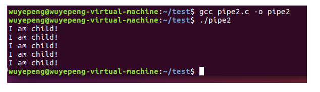
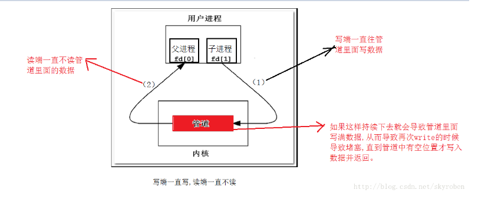
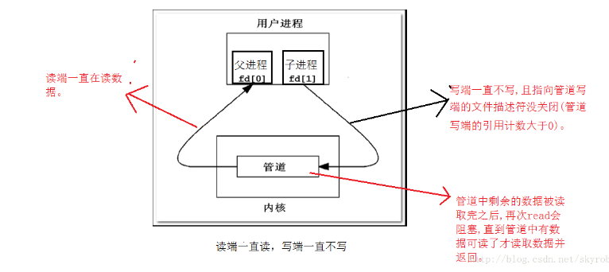
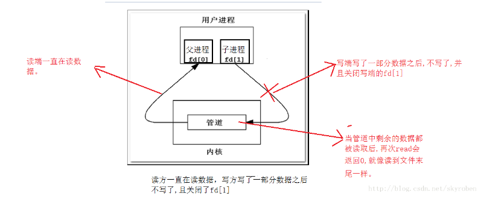
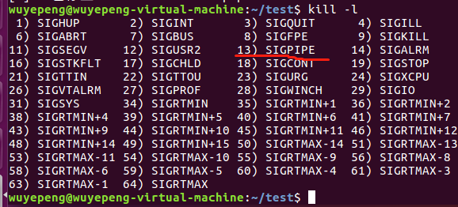
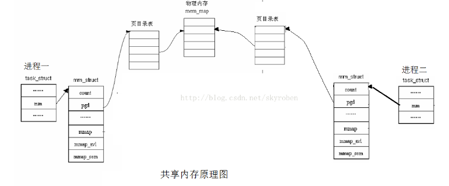
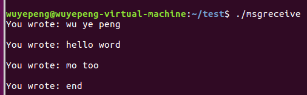
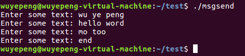

 进程之间的通信方式有四种分别是：
* [1. 管道](#1-管道)
* [2. 共享内存](#2-共享内存)
* [3. 消息队列](#3-消息队列)
* [4. 信号](#4-信号)


# 1. 管道
## 1.1管道的创建
管道是由调用pipe函数来创建
```c++
#include <unistd.h>
int pipe (int fd[2]);
//返回:成功返回0，出错返回-1
```
　fd参数返回两个文件描述符,fd[0]指向管道的读端,fd[1]指向管道的写端。fd[1]的输出是fd[0]的输入。
## 1.2管道如何实现进程间的通信
（1）父进程创建管道，得到两个件描述符指向管道的两端

（2）父进程fork出子进程，子进程也有两个文件描述符指向同管道。

（3）父进程关闭fd[0],子进程关闭fd[1]，即子进程关闭管道读端,父进程关闭管道写端（因为管道只支持单向通信）。子进程可以往管道中写,父进程可以从管道中读,管道是由环形队列实现的,数据从写端流入从读端流出,这样就实现了进程间通信。

## 1.3如何用代码实现管道通信
 <div align="center">  </div><br>
代码：  

```c++
#include<stdio.h>
#include<unistd.h>
#include<string.h>
#include<errno.h>
int main()
{
    int fd[2];
    int ret=pipe(fd);
    if(ret==-1)
    {
        perror("pipe error\n");
        return -1;
    }
    pid_t id=fork();
    if(id==0)
    {
        int i=0;
        close(fd[0]);
        char* child="I am child!";
        while(i<5)
        {
            write(fd[1],child,strlen(child)+1);
            sleep(2);
            i++;
        }
    }
    else if(id>0)
    {
        close(fd[1]);
        char msg[100];
        int j=0;
        while(j<5)
        {
            memset(msg,'\0',sizeof(msg));
            ssize_t s=read(fd[0],msg,sizeof(msg));
            if(s>0)
            {
                msg[s-1]='\0';
            }
            printf("%s\n",msg);
            j++;
        }
    }
    else
    {
        perror("fork error\n");
        return -1;
    }
    return 0;
}
```
运行结果：运行结果：每隔2秒打印一次I am child! 并且打印了五次。
 <div align="center">  </div><br>
## 1.4管道读取数据的四种情况
（1）读端不读（fd[0]未关闭），写端一直写
 <div align="center">  </div><br>
（2）写端不写（fd[1]未关闭），读端一直读
 <div align="center">  </div><br>
（3）读端一直读，且fd[0]保持打开，而写端写了一部分数据不写了，并且关闭fd[1]
 <div align="center">  </div><br>
（4）读端度了一部分数据，不读了且关闭fd[0]，写端一直在写且fd[1]还保持打开状态。
 <div align="center">  </div><br>
代码：
```c++
#include<stdio.h>
#include<unistd.h>
#include<string.h>
#include<errno.h>
int main()
{
    int fd[2];
    int ret=pipe(fd);
    if(ret==-1)
    {
        perror("pipe error\n");
        return -1;
    }
    pid_t id=fork();
    if(id==0)
    {
        int i=0;
        close(fd[0]);
        char *child="I am child!";
        while(i<10)
        {
            write(fd[1],child,strlen(child)+1);
            sleep(2);
            i++;
        }
    }
    else if(id>0)
    {
        close(fd[1]);
        char msg[100];
        int status=0;
        int j=0;
        while(j<5)
        {
            memset(msg,'\0',sizeof(msg));
            ssize_t s=read(fd[0],msg,sizeof(msg));
            if(s>0)
            {
                msg[s-1]='\0';
            }
            printf("%s %d\n",msg,j);
            j++;
        }
        //写方还在继续,而读方已经关闭它的读端 
        close(fd[0]);
        pid_t ret=waitpid(id,&status,0);
        printf("exitsingle(%d),exit(%d)\n",status&0xff,(status>>8)&0xff);
        //低八位存放该子进程退出时是否收到信号 
        //此低八位子进程正常退出时,退出码是多少
    }
    else
    {
        perror("fork error\n");
        return -1;
    }
    return 0;
}
```
运行结果：
 <div align="center">  </div><br>
使用kill-l 查看13号信号，可以知道13号信号代表SIGPIPE
 <div align="center">  </div><br>
总结：  
如果一个管道的写端一直在写，而读端的引⽤计数是否⼤于0决定管道是否会堵塞，引用计数大于0，只写不读再次调用write会导致管道堵塞；   
如果一个管道的读端一直在读，而写端的引⽤计数是否⼤于0决定管道是否会堵塞，引用计数大于0，只读不写再次调用read会导致管道堵塞；   
而当他们的引用计数等于0时，只写不读会导致写端的进程收到一个SIGPIPE信号，导致进程终止，只写不读会导致read返回0,就像读到件末尾样。  
## 1.5管道特点
1.管道只允许具有血缘关系的进程间通信，如父子进程间的通信。

2.管道只允许单向通信。

3.管道内部保证同步机制，从而保证访问数据的一致性。

4.面向字节流

5.管道随进程，进程在管道在，进程消失管道对应的端口也关闭，两个进程都消失管道也消失。

## 1.6管道的容量
测试管道容量大小只需要将写端一直写，读端不读且不关闭fd[0],即可。 
测试代码：

```c++
#include <stdio.h>
#include <unistd.h>
#include <string.h>
#include <errno.h>
int main()
{
    int fd[2];
    int ret = pipe(fd);
    if (ret == -1)
    {
        perror("pipe error\n");
        return -1;
    }
    pid_t id = fork();
    if (id == 0)
    {//child
        int i = 0;
        close(fd[0]);
        char *child = "I am  child!";
        while (++i)
        {
            printf("pipe capacity: %d\n", i*(strlen(child) + 1));
          //printf要写在write前面否则会因为write写满了而阻塞就不会进行下面的代码了，会使得输出计算少一次
            write(fd[1], child, strlen(child) + 1);
            
        }
        close(fd[1]);
    }
    else if (id>0)
    {//father
        close(fd[1]);//父进程的读端不能关闭，如果关闭了子进程写端会因为异常而退出
        waitpid(id, NULL, 0);
    }
    else
    {//error
        perror("fork error\n");
        return -1;
    }
    return  0;
}   
```

可以看到写到65520之后管道堵塞了，而65536即为64K大小即为管道的容量

原理是：我们写端每次写入的数据大小是13，统计我们可以进行多少次写入，写入次数 * 13就是管道容量，因为65533+13=65546>65536所以就不能继续输入了，有因为内存对齐问题，所以我们可以知道容量一定是64k
 <div align="center">  </div><br>
 
# 2. 共享内存  

## 2.1什么是共享内存

共享内存就是允许两个或多个进程共享一定的存储区。就如同malloc()函数向不同进程返回了指向同一个物理内存区域得到指针。当一个进程改变了这块地址中的内容的时候，其他进程都会察觉到这个更改。因为数据不需要在客户机和服务器端之间复制，数据直接写到内存，不用若干次数据拷贝，所以这是最快的一种IPC。  
注：共享内存没有任何的同步与互斥机制，所以要使用信号量来实现对共享内存的存取的同步。  
 <div align="center">  </div><br>

## 2.2共享内存特点和优势

让两个进程地址通过页表映射到同一片物理地址以便于通信，可以给一个区域里面写入数据，也可以从这片区域里读取数据，这就构成了进程间的双向通信，而且共享内存是IPC通信当中传输速度最快的通信方式没有之一。理由很简单，客户进程和服务进程传递的数据直接从内存里存取，数据不需要再两进程间复制，没有什么操作比这更快的了，再者用共享内存进行数据通信，它对数据也没啥限制。  
共享内存的生命周期随内核。即所有访问共享内存区域对象的进程都已经正常结束，共享内存区域对象仍然在内核中存在（除非显式删除共享内存区域对象），在内核重新引导之前，对该共享内存区域对象的任何改写操作都将一直保留；简单地说，共享内存区域对象的生命周期跟系统内核的生命周期是一致的，而且共享内存区域对象的作用域范围就是在整个系统内核的生命周期之内。  

缺陷
共享内存并未提供同步机制，也就是说，在一个服务进程结束对共享内存放到写操作之前，并没有自动机制可以阻止另一个进程（客户进程）开始对它进行读取。这明显还达不到我们想要的，我们不单是在量进程之间交互数据，还想实现多个进程对共享内存的同步访问，这也正是使用共享的窍门所在。基于此，我们通常会用平时谈到和用到信号量来实现对共享内存访问控制。  

## 2.3与共享内存有关的函数

所有的函数共用头文件
```c++
#include<sys/types.h>
#include<sys/ipc.h>
#include<sys/shm.h>
```
创建共享内存-》shmget()函数
```c++
int shmget(key_t key,size_t size,int shmflg);
```
(1)第一个参数key是长整型（唯一非零），系统建立IPC通讯 （ 消息队列、 信号量和 共享内存） 时必须指定一个ID值。通常情况下，该id值通过ftok函数得到，由内核变成标识符，要想让两个进程看到同一个信号集，只需设置key值不变就可以。
 
 (2)第二个参数size指定共享内存的大小，它的值一般为一页大小的整数倍（未到一页，操作系统向上对齐到一页，但是用户实际能使用只有自己所申请的大小）。
 
 (3)第三个参数shmflg是一组标志，创建一个新的共享内存，将shmflg 设置了IPC_CREAT标志后，共享内存存在就打开。而IPC_CREAT | IPC_EXCL则可以创建一个新的，唯一的共享内存，如果共享内存已存在，返回一个错误。一般我们会还或上一个文件权限
 
 操作共享内存-》shmctl()函数
 ```c++
 int shmctl(int shm_id,int cmd,struct shmid_ds *buf);//成功返回0，出错返回-1
 ```
 (1)第一个参数，shm_id是shmget函数返回的共享内存标识符。
 
(2)第二个参数，cmd是要采取的操作，它可以取下面的三个值 ：    
 
IPC_STAT：把shmid_ds结构中的数据设置为共享内存的当前关联值，即用共享内存的当前关联值覆盖shmid_ds的值。    
 
IPC_SET：如果进程有足够的权限，就把共享内存的当前关联值设置为shmid_ds结构中给出的值    
 
IPC_RMID：删除共享内存段
 
(3)第三个参数，buf是一个结构指针，它指向共享内存模式和访问权限的结构。 shmid_ds结构至少包括以下成员 
```c++
struct shmid_ds 
{ 
    uid_t shm_perm.uid; 
    uid_t shm_perm.gid; 
    mode_t shm_perm.mode; 
};
```
挂接操作-》shmat()函数
创建共享存储段之后，将进程连接到它的地址空间
```c++
void *shmat(int shm_id, const void *shm_addr, int shmflg);//成功返回指向共享存储段的指针，出错返会-1
```
(1)第一个参数，shm_id是由shmget函数返回的共享内存标识。

(2)第二个参数，shm_addr指定共享内存连接到当前进程中的地址位置，通常为空，表示让系统来选择共享内存的地址。

(3)第三个参数，shm_flg是一组标志位，通常为0

分离操作-》shmdt()函数
该操作不从系统中删除标识符和其数据结构，要显示调用shmctl(带命令IPC_RMID)才能删除它
```c++
int shmdt(const void *shmaddr);
            //成功返回0，出错返回-1
```
(1)addr参数是以前调用shmat时的返回值

## 2.4模拟实现进程间的通信方式-》共享内存

下面就以两个不相关的进程来说明进程间如何通过共享内存来进行通信。其中一个文件shmread.c创建共享内存，并读取其中的信息，另一个文件shmwrite.c向共享内存中写入数据。为了方便操作和数据结构的统一，为这两个文件定义了相同的数据结构，定义在文件shmdata.c中。结构shared_use_st中的written作为一个可读或可写的标志，非0：表示可读，0表示可写，text则是内存中的文件。
shmdata.h的源代码如下：
```c++
#ifndef _SHMDATA_H_HEADER
#define _SHMDATA_H_HEADER
#define TEXT_SZ 2048
struct shared_use_st
{  
    int written;//作为一个标志，非0：表示可读，0表示可写 
    char text[TEXT_SZ];//记录写入和读取的文本
};
#endif
```
源文件shmread.c的源代码如下：
```c++
#include <unistd.h>
#include <stdlib.h>
#include <stdio.h>
#include <sys/shm.h>
#include "shmdata.h"
int main()
{  
    int running = 1;//程序是否继续运行的标志  
    void *shm = NULL;//分配的共享内存的原始首地址   
    struct shared_use_st *shared;//指向shm   
    int shmid;//共享内存标识符 //创建共享内存   
    shmid = shmget((key_t)1234, sizeof(struct shared_use_st), 0666|IPC_CREAT);
    if(shmid == -1)
    {      
        fprintf(stderr, "shmget failed\n");
        exit(EXIT_FAILURE);
    }   //将共享内存连接到当前进程的地址空间
    shm = shmat(shmid, 0, 0);
    if(shm == (void*)-1)   
    {  
        fprintf(stderr, "shmat failed\n"); 
        exit(EXIT_FAILURE);
    }  
    printf("\nMemory attached at %X\n", (int)shm);  //设置共享内存   
    shared = (struct shared_use_st*)shm;   
    shared->written = 0;
    while(running)//读取共享内存中的数据 
    {       //没有进程向共享内存定数据有数据可读取       
        if(shared->written != 0)
        {      
            printf("You wrote: %s", shared->text);      
            sleep(rand() % 3);          //读取完数据，设置written使共享内存段可写
            shared->written = 0;         //输入了end，退出循环（程序）  
            if(strncmp(shared->text, "end", 3) == 0)    
                running = 0;       
        }      
        else//有其他进程在写数据，不能读取数据     
            sleep(1);  
    }   //把共享内存从当前进程中分离
    if(shmdt(shm) == -1)   
    {      
        fprintf(stderr, "shmdt failed\n");     
        exit(EXIT_FAILURE);
    }   //删除共享内存   
    if(shmctl(shmid, IPC_RMID, 0) == -1)   
    {  
        fprintf(stderr, "shmctl(IPC_RMID) failed\n");  
        exit(EXIT_FAILURE);
    }  
    exit(EXIT_SUCCESS);
}
```
源文件shmwrite.c的源代码如下：
```c++
#include <unistd.h>
#include <stdlib.h>
#include <stdio.h>
#include <string.h>
#include <sys/shm.h>
#include "shmdata.h"
int main()
{  
    int running = 1;   
    void *shm = NULL;  
    struct shared_use_st *shared = NULL;
    char buffer[BUFSIZ + 1];//用于保存输入的文本
    int shmid;  //创建共享内存
    shmid = shmget((key_t)1234, sizeof(struct shared_use_st), 0666|IPC_CREAT);
    if(shmid == -1)
    {  
        fprintf(stderr, "shmget failed\n");
        exit(EXIT_FAILURE);
    }   //将共享内存连接到当前进程的地址空间
    shm = shmat(shmid, (void*)0, 0);   
    if(shm == (void*)-1)
    {  
        fprintf(stderr, "shmat failed\n");     
        exit(EXIT_FAILURE);
    }  
    printf("Memory attached at %X\n", (int)shm);    //设置共享内存   
    shared = (struct shared_use_st*)shm;   
    while(running)//向共享内存中写数据  
    {       //数据还没有被读取，则等待数据被读取,不能向共享内存中写入文本       
        while(shared->written == 1)     
        {          
            sleep(1);      
            printf("Waiting...\n");
        }       //向共享内存中写入数据       
        printf("Enter some text: ");       
        fgets(buffer, BUFSIZ, stdin);      
        strncpy(shared->text, buffer, TEXT_SZ);      //写完数据，设置written使共享内存段可读       
        shared->written = 1;     //输入了end，退出循环（程序）  
        if(strncmp(buffer, "end", 3) == 0)         
            running = 0;   
    }   //把共享内存从当前进程中分离
    if(shmdt(shm) == -1)   
    {      
        fprintf(stderr, "shmdt failed\n");     
        exit(EXIT_FAILURE);
    }  
    sleep(2);  
    exit(EXIT_SUCCESS);
}
```

分析：  
1、程序shmread创建共享内存，然后将它连接到自己的地址空间。在共享内存的开始处使用了一个结构struct_use_st。该结构中有个标志written，当共享内存中有其他进程向它写入数据时，共享内存中的written被设置为0，程序等待。当它不为0时，表示没有进程对共享内存写入数据，程序就从共享内存中读取数据并输出，然后重置设置共享内存中的written为0，即让其可被shmwrite进程写入数据。
 
2、程序shmwrite取得共享内存并连接到自己的地址空间中。检查共享内存中的written，是否为0，若不是，表示共享内存中的数据还没有被完，则等待其他进程读取完成，并提示用户等待。若共享内存的written为0，表示没有其他进程对共享内存进行读取，则提示用户输入文本，并再次设置共享内存中的written为1，表示写完成，其他进程可对共享内存进行读操作。
 
四、关于前面的例子的安全性讨论
这个程序是不安全的，当有多个程序同时向共享内存中读写数据时，问题就会出现。可能你会认为，可以改变一下written的使用方式，例如，只有当written为0时进程才可以向共享内存写入数据，而当一个进程只有在written不为0时才能对其进行读取，同时把written进行加1操作，读取完后进行减1操作。这就有点像文件锁中的读写锁的功能。咋看之下，它似乎能行得通。但是这都不是原子操作，所以这种做法是行不能的。试想当written为0时，如果有两个进程同时访问共享内存，它们就会发现written为0，于是两个进程都对其进行写操作，显然不行。当written为1时，有两个进程同时对共享内存进行读操作时也是如些，当这两个进程都读取完是，written就变成了-1.
 
要想让程序安全地执行，就要有一种进程同步的进制，保证在进入临界区的操作是原子操作。例如，可以使用前面所讲的信号量来进行进程的同步。因为信号量的操作都是原子性的。
五、使用共享内存的优缺点
1、优点：我们可以看到使用共享内存进行进程间的通信真的是非常方便，而且函数的接口也简单，数据的共享还使进程间的数据不用传送，而是直接访问内存，也加快了程序的效率。同时，它也不像匿名管道那样要求通信的进程有一定的父子关系。
 
2、缺点：共享内存没有提供同步的机制，这使得我们在使用共享内存进行进程间通信时，往往要借助其他的手段来进行进程间的同步工作。

# 3. 消息队列
## 3.1什么是消息队列
消息队列提供了一种从一个进程向另一个进程发送一个数据块的方法。  每个数据块都被认为含有一个类型，接收进程可以独立地接收含有不同类型的数据结构。我们可以通过发送消息来避免命名管道的同步和阻塞问题。但是消息队列与命名管道一样，每个数据块都有一个最大长度的限制。
 
Linux用宏MSGMAX和MSGMNB来限制一条消息的最大长度和一个队列的最大长度。
 
## 3.2在Linux中使用消息队列
Linux提供了一系列消息队列的函数接口来让我们方便地使用它来实现进程间的通信。它的用法与其他两个System V PIC机制，即信号量和共享内存相似。
 
1、msgget函数
该函数用来创建和访问一个消息队列。它的原型为：
```c++
int msgctl(int msgid, int command, struct msgid_ds *buf);
```
command是将要采取的动作，它可以取3个值，
    IPC_STAT：把msgid_ds结构中的数据设置为消息队列的当前关联值，即用消息队列的当前关联值覆盖msgid_ds的值。
    IPC_SET：如果进程有足够的权限，就把消息列队的当前关联值设置为msgid_ds结构中给出的值
    IPC_RMID：删除消息队列
 
buf是指向msgid_ds结构的指针，它指向消息队列模式和访问权限的结构。msgid_ds结构至少包括以下成员：
```c++
struct msgid_ds
{
    uid_t shm_perm.uid;
    uid_t shm_perm.gid;
    mode_t shm_perm.mode;
};
```
成功时返回0，失败时返回-1.
 
## 3.3使用消息队列进行进程间通信
马不停蹄，介绍完消息队列的定义和可使用的接口之后，我们来看看它是怎么让进程进行通信的。由于可以让不相关的进程进行行通信，所以我们在这里将会编写两个程序，msgreceive和msgsned来表示接收和发送信息。根据正常的情况，我们允许两个程序都可以创建消息，但只有接收者在接收完最后一个消息之后，它才把它删除。
 
接收信息的程序源文件为msgreceive.c的源代码为：
```c++
/*使用消息队列通信*/
#include <unistd.h>
#include <stdlib.h>
#include <stdio.h>
#include <string.h>
#include <errno.h>
#include <sys/msg.h>
struct msg_st
{  
    long int msg_type; 
    char text[BUFSIZ];
};
int main()
{  
    int running = 1;   
    int msgid = -1;
    struct msg_st data;
    long int msgtype = 0; //注意1     //建立消息队列   
    msgid = msgget((key_t)1234, 0666 | IPC_CREAT); 
    if(msgid == -1)
    {      
        fprintf(stderr, "msgget failed with error: %d\n", errno);  
        exit(EXIT_FAILURE);
    }   //从队列中获取消息，直到遇到end消息为止 
    while(running) 
    {  
        if(msgrcv(msgid, (void*)&data, BUFSIZ, msgtype, 0) == -1)  
        {  
            fprintf(stderr, "msgrcv failed with errno: %d\n", errno);  
            exit(EXIT_FAILURE);    
        }  
        printf("You wrote: %s\n",data.text);        //遇到end结束  
        if(strncmp(data.text, "end", 3) == 0)      
            running = 0;   
    }   //删除消息队列   
    if(msgctl(msgid, IPC_RMID, 0) == -1)   
    {      
        fprintf(stderr, "msgctl(IPC_RMID) failed\n");  
        exit(EXIT_FAILURE);
    }  
    exit(EXIT_SUCCESS);
}
```
发送信息的程序的源文件msgsend.c的源代码为：
```c++
#include <unistd.h>
#include <stdlib.h>
#include <stdio.h>
#include <string.h>
#include <sys/msg.h>
#include <errno.h>
#define MAX_TEXT 512
struct msg_st
{  
    long int msg_type; 
    char text[MAX_TEXT];
};
int main()
{  
    int running = 1;   
    struct msg_st data;
    char buffer[BUFSIZ];
    int msgid = -1;     //建立消息队列
    msgid = msgget((key_t)1234, 0666 | IPC_CREAT);
    if(msgid == -1)
    {  
        fprintf(stderr, "msgget failed with error: %d\n", errno);  
        exit(EXIT_FAILURE);
    }   //向消息队列中写消息，直到写入end
    while(running) 
    {       //输入数据 
        printf("Enter some text: ");   
        fgets(buffer, BUFSIZ, stdin);  
        data.msg_type = 1;    //注意2    
        strcpy(data.text, buffer);      //向队列发送数据  
        if(msgsnd(msgid, (void*)&data, MAX_TEXT, 0) == -1) 
        {      
            fprintf(stderr, "msgsnd failed\n");    
            exit(EXIT_FAILURE);    
        }       //输入end结束输入    
        if(strncmp(buffer, "end", 3) == 0)     
            running = 0;   
        sleep(1);
    }  
    exit(EXIT_SUCCESS);
}
```
运行结果：  
 <div align="center">  </div><br>
  <div align="center">  </div><br>

## 3.4例子分析——消息类型
 
这里主要说明一下消息类型是怎么一回事，注意msgreceive.c文件main函数中定义的变量msgtype（注释为注意1），它作为msgrcv函数的接收信息类型参数的值，其值为0，表示获取队列中第一个可用的消息。再来看看msgsend.c文件中while循环中的语句data.msg_type = 1（注释为注意2），它用来设置发送的信息的信息类型，即其发送的信息的类型为1。所以程序msgreceive能够接收到程序msgsend发送的信息。
 
如果把注意1，即msgreceive.c文件main函数中的语句由long int msgtype = 0;改变为long int msgtype = 2;会发生什么情况，msgreceive将不能接收到程序msgsend发送的信息。因为在调用msgrcv函数时，如果msgtype（第四个参数）大于零，则将只获取具有相同消息类型的第一个消息，修改后获取的消息类型为2，而msgsend发送的消息类型为1，所以不能被msgreceive程序接收。重新编译msgreceive.c文件并再次执行，其结果如下：
 <div align="center">  </div><br>

我们可以看到，msgreceive并没有接收到信息和输出，而且当msgsend输入end结束后，msgreceive也没有结束，通过jobs命令我们可以看到它还在后台运行着。
 
## 3.5消息队列与命名管道的比较
 
消息队列跟命名管道有不少的相同之处，通过与命名管道一样，消息队列进行通信的进程可以是不相关的进程，同时它们都是通过发送和接收的方式来传递数据的。在命名管道中，发送数据用write，接收数据用read，则在消息队列中，发送数据用msgsnd，接收数据用msgrcv。而且它们对每个数据都有一个最大长度的限制。
 
与命名管道相比，消息队列的优势在于，1、消息队列也可以独立于发送和接收进程而存在，从而消除了在同步命名管道的打开和关闭时可能产生的困难。2、同时通过发送消息还可以避免命名管道的同步和阻塞问题，不需要由进程自己来提供同步方法。3、接收程序可以通过消息类型有选择地接收数据，而不是像命名管道中那样，只能默认地接收。


# 4. 信号


# 5. socket
