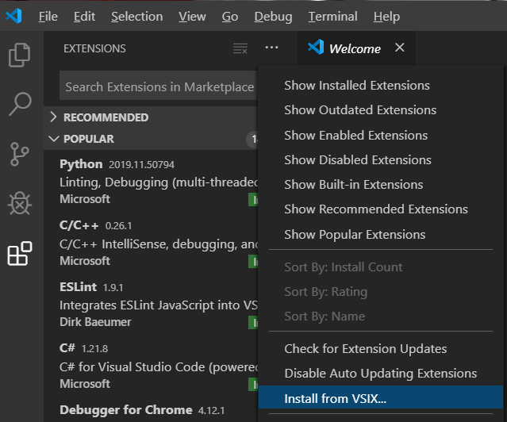
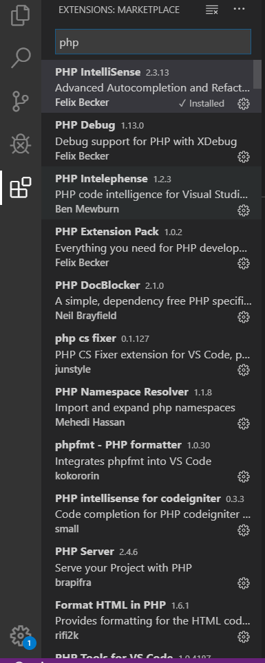

## php开发环境的搭建

一、安装php

官网地址：https://www.apachefriends.org/index.html

安装后，将把php.exe所在文件夹添加进系统变量path中，就可以了。

二、安装vscode中的php扩展插件

因为有墙直接在vscode中下载php插件可能下载不了，我们可以到vscode插件官方网站下载插件安装包，然后手动安装插件包

（1）vscode扩展包官方网站，下载离线包 

 下载地址：https://marketplace.visualstudio.com/vscode

（2）安装扩展包

点击Install from VSIX...按钮，已经下载好的插件包，就可以安装了，安装成功后点击左边标红的按钮会看到已经安装成功的插件。

下面是我已经下载好的php需要用的部分插件，主要是Debug、显色、跳转到函数定义，函数搜索等功能，让阅读和开发更加方便。

