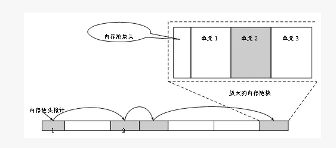

* [操作系统目标](#操作系统目标)
* [操作系统基本特性](#操作系统基本特性)
* [描述多道批处理、分时、实时操作系统的特点各是什么](#描述多道批处理分时实时操作系统的特点各是什么)
* [作业调度算法](#作业调度算法)
* [死锁](#死锁)
* [内存池](#内存池)
* [分页式内存管理](#分页式内存管理)
* [分段式内存管理](#分段式内存管理)
* [段页式内存管理](#段页式内存管理)
* [分页和分段的区别](#分页和分段的区别)
* [什么是虚拟内存](#什么是虚拟内存)
* [虚拟内存和物理内存的区别](#虚拟内存和物理内存的区别)
* [虚拟存储器](#虚拟存储器)
* [页面置换算法](#页面置换算法)
* [颠簸](#颠簸)
* [Linux如何避免内存碎片化](#linux如何避免内存碎片化)
* [内部碎片和外部碎片](#内部碎片和外部碎片)
* [动态链接库与静态链接库的区别](#动态链接库与静态链接库的区别)
* [一个程序从开始运行到结束的完整过程](#一个程序从开始运行到结束的完整过程)
* [临界资源](#临界资源)
* [动态分配算法](#动态分配算法)
* [磁盘存储器管理](#磁盘存储器管理)
* [文件管理](#文件管理)
* [程序和进程的区别](#程序和进程的区别)
* [什么是缓冲区溢出？有什么危害？其原因是什么？](#什么是缓冲区溢出有什么危害其原因是什么)
# 操作系统目标
1.方便性  2.有效性  3.可拓展性   4.开放性

# 操作系统基本特性
1.并发 2.共享  3.虚拟  4.异步

# 描述多道批处理、分时、实时操作系统的特点各是什么
批处理操作系统：多道性，无序性，调度性，系统利用率高，吞吐量大，平均周转时间长，但无交互能力。  
分时操作系统：有多路性，独立性和交互性。有较好的人机交互的特性，并且可以实现共享主机  
实时系统：有多路性，独立性，及时性，交互性和可靠性。实际上是指操作系统工作时，其各种资源可以根据需要随时进行动态分配。由于各种资源可以进行动态分配，因此，其处理事务的能力较强，速度较快。  
总结：从可靠性：实时系统更强   从交互性：分时系统更强

# 作业调度算法
1.先来先服务算法（FSFS）  
最简单的调度算法，即可以用于作业调度也可用于进程调度，系统按照作业到达的先后顺序进行调度，或者是优先考虑在系统中等待的时间最长的作业。

2：短作业优先调度算法（SJF）
实际情况短作业占有比例很大，为了使他们比长作业优先执行，而产生了短作业优先的调度算法 ，作业越短优先级越高，
缺点：是必须知道作业的运行时间，对长作业不利，人机无法实现交互，未完全考虑作业的紧迫程度

3：优先级调度算法（PSA）
优先级：对于先来先服务算法，作业的等待时间就是他的优先级，等待时间越长优先级越高，对于短作业优先级作业的长短就是他的优先级。在优先级算法中，基于作业的紧迫程度。

4：高响应比优先调度算法（HRRN）

在FSFS中只是考虑作业的等待时间而忽略作业的运行时间，SJF算法正好相反，高响应比算法既考虑作业的等待时间有考虑作业的运行时间，

优先权 =  （等待时间+要求服务时间）/要求服务时间

由于等待时间与服务时间之和就是作业的相应时间，顾优先级相当于响应比：Rp

Rp = （等待时间+要求服务时间）/要求服务时间 = 响应时间/要求服务时间

# 死锁
### 什么是死锁
死锁是指多个进程因竞争资源而造成的一种僵局（互相等待），若无外力作用，这些进程都将无法向前推进。例如，在某一个计算机系统中只有一台打印机和一台输入设备，进程P1正占用输入设备，同时又提出使用打印设备的请求，但此时打印机正被进程P2所占用，而P2在未释放打印机之前，又提出请求使用正被P1占用着的输入设备。这样两个进程互相无休无止地等待下去，均无法继续执行，此时两个进程陷入死锁状态。

### 死锁产生的原因
1.系统资源的竞争  
系统资源的竞争导致系统资源不足，以及资源分配不当，导致死锁。  
2.进程运行推进顺序不适当  
进程在运行过程中，请求和释放资源的顺序不当，会导致死锁

### 死锁产生的条件
1.互斥条件：一个资源每次只能被一个进程使用，即在一段时间内某资源仅为一个进程所占有。此时若有其他进程请求该资源，则请求进程只能等待。  

2.请求与保持条件：进程已经保持了至少一各资源，但又提出了新的资源的请求，而该资源已被其他进程所占有，此时请求进程被阻塞，但对自己已获得的资源保持不。  
3.不可剥夺条件：进程所获得的资源在未使用完毕之前，不能被其他进程强行夺走，即只能由获得该资源的进程自己来释放（只能是自己释放）

4.循环等待条件：若干进程间形成首尾相接循环等待资源的关系

这四个条件是死锁的必要条件，只要系统发生死锁，这些条件必然成立，而只要上述条件之一不满足，就不会发生死锁。

### 处理死锁的方法
1.预防死锁：通过设置某些限制条件，去破坏产生死锁的四个必要条件中的一个或几个条件，来预防死锁的发生。

2.避免死锁：在资源的动态分配过程中，用某种方法去防止系统进入不安全状态，从而避免死锁的发生。

3.检测死锁：允许系统在运行过程中发生死锁，但可设置检测机构及时检测死锁的发生，并采取适当措施加以清除

4.解除死锁：当检测出死锁后，便采取适当措施将进程从死锁状态中解脱出来

#### 预防死锁
1.破坏“互斥”条件  
就是在系统里取消互斥。若资源不被一个进程独占使用，那么死锁是肯定不会发生的。但一般来说在所列的四个条件中，“互斥”条件是无法破坏的。因此，在死锁预防里主要是破坏其他几个必要条件，而不去涉及破坏“互斥”条件。  
注意：互斥条件不能被破坏，否则会造成结果的不可再现性

2.破坏“占有并等待”条件  
破坏“占有并等待”条件，就是在系统中不允许进程在已获得某种资源的情况下，申请其他资源。即要想出一个办法，阻止进程在持有资源的同时申请其他资源。  
方法一：创建进程时，要求它申请所需的全部资源、系统或满足其所要求，或什么都不给它。这是所谓的“一次性分配”方案。  
方法二：要求每个进程提出新的资源申请前，释放它所占有的资源。这样，一个进程在需要资源S时，须先把它先前占有的资源R释放掉，然后才能提出对资源S的申请，即使它可能很快又要用到资源R。

3.破坏“不可抢占”条件  
破坏“不可抢占”条件是允许对资源实行抢夺  
方法一：如果占有某些资源的一个进程进行进一步资源申请被拒绝，则该进程必须释放它最初占有的资源，如果有必要，可再次请求这些资源和另外的资源。  
方法二：如果一个进程请求当前被另一个进程占有的一个资源，则操作系统可以抢占另一个进程，要求它释放资源。只要在任意两个进程的优先级都不相同的条件下，方法二才能预防死锁。  

4.破坏“循环等待”条件  
破坏“循环等待”条件的一种方法，是将系统的所有资源统一编号，进程可在任何时刻提出资源申请，但所有申请必须按照资源的编号顺序（升序）提出。这样做就能保证系统不出现死锁。

#### 避免死锁
预防死锁和避免死锁的区别：  
预防死锁是设法至少破坏产生死锁的四个必要条件之一，严格的防止死锁的出现，而避免死锁则不那么严格的限制产生死锁的必要条件的存在，因为即使死锁的必要条件存在，也不一定发生死锁。避免死锁是在系统运行过程中注意避免死锁的最终发生。

1.有序资源分配法  
这种算法资源按某种规则系统中的所有资源统一编号（例如打印机为1，磁带机为2，磁盘为3等）申请时必须以上升的次序。系统要求申请进程：  
（1）对它所必须使用的而且属于同一类的所有资源，必须一次申请完。  
（2）在申请不同类资源时，必须按各类设备的编号依次申请。例如：进程PA，使用资源的顺序是R1，R2.进程PB，使用资源的顺序是R2,R1若采用动态分配有可能形成环路条件，造成死锁。  
采用有序资源分配法：R1的编号为1，R2的编号为2；  
PA：申请次序是:R1,R2  
PB：申请次序是：R1,R2  
这样就破坏了环路条件，避免了死锁的发生

2.银行家算法  
当一个进程申请使用资源的时候，银行家算法通过先 试探 分配给该进程资源，然后通过安全性算法判断分配后的系统是否处于安全状态，若不安全则试探分配作废，让该进程继续等待。  
四个条件：  
1.分批向银行贷款时，申请的总额不能超过一开始申请的额度。  
2.申请贷款时不能超过银行现有资金的数目。  
3.当银行资金不能满足顾客贷款需求时，可以推迟支付，但是肯定会让顾客在需求时间内得到贷款。  
4.顾客拿到贷款后必须在规定时间内归还

3.系统安全状态法  
即在分配资源之前，就应该检测此次资源分配的安全性，如果此次分配资源会导致进程进入不安全状态，那就等待，如果不会，则分配资源

# 内存池
　　内存池是指程序预先从操作系统申请一块足够大内存，此后，当程序中需要申请内存的时候，不是直接向操作系统申请，而是直接从内存池中获取；同理，当程序释放内存的时候，并不是将内存返回给操作系统，而是返回内存池，当程序退出（或者特点时间）时，内存池才将之前申请的内存真正释放。
### 默认的内存管理函数的不足
1.malloc/free和new/delete在堆上申请和释放的内存都有一定的额外开销。

2.开销来自维护内存空闲块表

3.malloc和new申请堆内存时，首先查找内部维护的空闲块表，并且需要根据一定的算法（例如分配最先找到的不小于申请大小的内存块给请求者，或者分配最适于申请大小的内存块，或者分配最大空闲的内存块等）找到合适大小的空闲内存块。如果该空闲内存块过大，还需要切割成已分配的部分和较小的空闲块。然后系统更新内存空闲块表，完成一次内存分配

4.类似地，在free和delete释放内存时，系统把释放的内存块重新加入到空闲内存块表中。如果有可能的话，可以把相邻的空闲块结合并成较大的空闲块。

5.默认的内存管理函数还考虑到多线程的应用，需要在每次分配和释放内存时加锁，同样增加了开销

6.可见，如果应用程序频繁地在堆上分配和释放内存，则会导致性能的损失。并且会使系统中出现大量的内存碎片，降低内存的利用率

7.默认的分配和释放内存算法自然也考虑了性能，然而这些内存管理算法的通用版本为了应付更复杂、更广泛的情况，需要做更多的额外工作。而对于某一个具体的应用程序来说，适合自身特定的内存分配释放模式的自定义内存池则可以获得更好的性能。

### 内存池的定义
　　应用程序可以通过调用系统的内存分配函数预先一次性申请适当大小的内存作为一个内存池，并为这个内存池或结构体定义一些分配和释放内存块的成员函数。之后应用程序自己对内存的分配和释放则可以通过这个内存池及其成员函数来完成。只有的那个内存池大小需要动态扩展时，才需要再调用系统的内存分配函数，其他时间对内存的一切操作都在应用程序的掌控之中。
  
### 内存池的分类
1）从线程安全角度分为单线程内存池和多线程内存池  
-----
单线程内存池整个生命周期只被一个线程使用，因而不需要考虑互斥访问的问题。  

多线程内存池有可能被多个线程共享，因此需要在每次分配和释放内存时加锁

相对而言，单线程内存池性能更高，而多线程内存池适用范围更广

2）从内存池可分配内存单元大小来分为固定内存池和可变内存池  
-----------
固定内存池是指应用程序每次从内存池中分配出来的内存单元大小事先已经确定，是固定不变的，维护起来方便，性能更高

而可变内存池则每次从内存池中分配出来的内存单元大小可以按需变化，应用范围更广，而性能比固定内存池要低。

###  固定内存池工作原理
固定内存池由一系列固定大小的内存块组成，每一个内存块又包含了固定数量和大小的内存单元。  

 <div align="center">  </div><br>

上图中，内存池=4个内存块，一个内存块=块头+3个内存单位

在内存池初次生成时，只向系统申请了一个内存块，返回的指针作为整个内存池的头指针。之后随着应用程序对内存的不断需求，内存池判断需要动态扩大时，才再次向系统申请新的内存块，并把所有这些内存块通过指针链接起来。

对于操作系统来说，它已经为该应用程序分配了4个等大小的内存块。由于是大小固定的，所以分配的速度比较快，而对于应用程序来说，其内存池使用了一定大小的内存单元，内存池内部却还有剩余的空间。

例如放大来看第4个内存块，其中包含一部分内存池块头信息和3个大小相等的内存单元。单元1和单元3是空闲的，单元2已经分配。当应用程序需要通过该内存池分配一个单元大小的内存时，只需要简单遍历所有的内存池块头信息，快速定位到还有空闲单位的那个内存池。  
【注意】：不需要遍历每个内存单元，各个内存块的块头信息中会记录本内存块中管理的内存单元的整体情况。  
然后根据该块的块头信息直接定位到第1个空闲的单元地址，把这个地址返回，并且标记下一个空闲单元即可，当应用程序释放某一个内存池单元时，直接在对应的内存池块信息中标记该内存单元为空闲单元即可  

### 与系统内存管理相比，内存池的操作非常迅速，性能优化方面的优点如下：  
（1）针对特殊情况，例如需要频繁分配释放固定大小的内存对象时，不需要复杂的分配算法和多线程/多进程保护（系统内存管理一直会加锁解锁）。也不需要维护内存空闲表的额外开销，只需要维护简单的内存池块头信息，从而获得较高的性能。  

（2）由于开辟一定数量的连续内存空间作为内存池块，因而一定程序上提高了程序局部性和数据访问的速度，提高了程序性能。  

（3）比较容易控制页边界对齐和内存对齐字节，没有内存碎片的问题。

### 一个单线程的固定内存池的实现
这是一个应用于单线程环境且分配单元大小固定的内存池，一般用来为执行时会动态频繁地创建且可能会被多次创建的类对象或者结构体分配内存

 <div align="center">  </div><br>

内存池类MemoryPool的声明如下：
```c++
class MemoryPool
{
private:
    MemoryBlock*   pBlock;            //内存池中内存块链表的头指针
    USHORT          nUnitSize;        //内存块中每个内存单元的字节大小
    USHORT          nInitSize;        //第一个内存块内存单元的个数
    USHORT          nGrowSize;        //后面要增加的内存块的内存单元的个数
 
public:
                     MemoryPool( USHORT nUnitSize,
                                  USHORT nInitSize = 1024,
                                  USHORT nGrowSize = 256 );  
                    ~MemoryPool();    //都是函数原型声明，在类外具体实现
 
    void*           Alloc();        //实际的给程序分配内存单元的接口函数
    void            Free( void* p );    //实际的程序释放归还内存单元给内存池的接口函数
};
```

MemoryBlock为内存池中附着在真正用来为内存请求分配内存的内存块头部的结构体，它描述了与之联系的内存块的使用信息
```c++
struct MemoryBlock
{
    USHORT          nSize;    //本内存块中内存单元的总字节大小
    USHORT          nFree;    //本内存块中空闲的内存单元个数
    USHORT          nFirst;   //本内存块中下一个可用的空闲内存单元下标位置
    USHORT          nDummyAlign1; //虚设的用于字节对齐的2字节，没实际用处
    MemoryBlock*  pNext;    //内存块链表的下一个指针
    char            aData;    //实际内存单元开始的1字节，给出首地址，
            //后面个内存单元地址都在此字节地址基础上加上偏移量（nFirst*nUnitSize）    
 
    //重载new操作符
    static void* operator new(size_t size, USHORT nTypes, USHORT nUnitSize)
    {
        size = sizeof(MemoryBlock) + nTypes * nUnitSize;
        return ::operator new(size);    //调用原始operator new 只分配空间
    }
    static void  operator delete(void *p)
    {
        ::operator delete (p);    //  释放对应的operator new 的空间
    }
 
    MemoryBlock (USHORT nTypes = 1, USHORT nUnitSize = 0);  //nTypes为内存单元个数
    ~MemoryBlock() {}      //内存块不做析构释放内存，交给内存池统一管理
};
```


# 分页式内存管理
分页存储的基本方法：  
1：页面和物理快   页面：分页存储管理将进程的逻辑地址空间分成若干页，并从0开始编号，把内存的物理地址分成若干块（物理快）

2：地址结构：   页号P ----- 偏移量W（包括页号P和偏移量W），对于特定的机器其地址结构一定，给定逻辑地址A，页面的大小为L，则页号P和页内地址D有一下关系：P = int[A/L]; d=[A] MOD L  例如：页面大小1kb A=2170B 得：p=2 d=122

3：页表：记录相应页在内存中对应的物理块号

4：地址转换机构：将用户逻辑空间的地址，转变为空间中的物理地址

# 分段式内存管理
分段是管理不会产生内存碎片（短号 ， 段内地址）  
分段管理方式的引入原因：  
1：一般程序分为若干段，如：主程序段、数据段、栈段等，每个段大多是一个相对独立的单位  
2：实现满足信息共享、信息保护、动态链接、以及信息动态增长等需要  

# 段页式内存管理
基本原理是分段和分页相结合，其地址结构由：段号、段内页号、页内地址三部分组成。在段页式系统中获得一条指令需要三次访问内存，第一次访问内存中的段表，第二次访问内存中的页表，第三次访问内存中的数据。

# 分页和分段的区别
分页和分段的区别：  
共同点：两者都采用离散分配方式，且都地址映射机构来实现地址的转换       
不同点：  
1：页是信息的物理单位采用分页存储管理方式是为了实现离散分配方法。提高内存的利用率，采用分段目的主要在于能更好的满足用户的需求  
2：页的大小固定且有系统决定，在采用分页存储管理方式中直接由硬件实现。而段的大小不固定，决定于用户所编写的程序  
3：分页的地址空间是一维的，分页完全是系统完全是行为，分段系统中是二维的。  

# 什么是虚拟内存
　　虚拟内存允许执行进程不必完全在内存中。虚拟内存的基本思想是：每个进程拥有独立的地址空间，这个空间被分为大小相等的多个块，称为页，每个页都是一段连续的地址。这些页被映射到物理内存，但并不是所有的页都必须在内存中才能运行程序。当程序引用到一部分在物理内存中的地址空间时，由硬件立刻进行必要的映射；当程序引用到一部分不在物理内存中的地址空间时，由操作系统负责将缺失的部分装入物理内存并重新执行失败的命令。这样，对于进程而言，逻辑上似乎有很大的内存空间，实际上其中一部分对应物理内存上的一块（称为帧，通常页和帧大小相等）还有一些没有加载的内存中的对应在硬盘上。
  
　　请求分页系统、请求分段系统、请求段页式系统都是针对虚拟内存的，通过请求实现内存与外存的信息置换。 
  
   <div align="center">  </div><br>
   
　　由上图可以看出，虚拟内存实际上可以比物理内存大，当访问虚拟内存时，会访问MMU（内存管理单元）去匹配对应的物理地址（比如0，1，2）如果虚拟内存的页并不存在于物理内存中（如 3，4）会产生缺页中断，从磁盘中取得缺得的页存入内存，如果内存已满，还会根据某种算法将磁盘中的页换出。

### 与传统存储器比较虚拟存储器有以下三个主要特征：

多次性，是指无需在作业运行时一次性地全部装入内存，而是允许被分成多次调入内存运行。     
对换性，是指无需在作业运行时一直常驻内存，而是允许在作业的运行过程中，进行换进和换出。     
虚拟性，是指从逻辑上扩充内存的容量，使用户所看到的内存容量，远大于实际的内存容量。  
### 虚拟内存的实现有以下两种方式：

请求分页存储管理。  
请求分段存储管理。  

# 虚拟内存和物理内存的区别

物理内即你电脑主板内存槽上的实际容量。虚拟内存是当物理内存不够用时系统自动从硬盘空间划分一些容量出来当做虚拟内存使用（即辅助物理内存）

# 虚拟存储器
操作系统的内容分为几块？什么叫做虚拟内存？他和主存的关系如何？内存管理属于操作系统的内容吗？  
　　操作系统的主要组成部分：进程和线程的管理，存储管理，设备管理，文件管理。虚拟内存是一些系统页文件，存放在磁盘上，每个系统页文件大小为4K，物 理内存也被分页，每个页大小也为4K，这样虚拟页文件和物理内存页就可以对应，实际上虚拟内存就是用于物理内存的临时存放的磁盘空间。页文件就是内存页， 物理内存中每页叫物理页，磁盘上的页文件叫虚拟页，物理页+虚拟页就是系统所有使用的页文件的总和。


# 页面置换算法

1.FIFO先进先出算法：在操作系统中经常被用到，比如作业调度  
2.LRU（least recently use）最近最少使用算法：根据使用时间到现在的长短来判断  
3.LFU(least frequently use)最少使用次数算法：根据使用次数来判断  
4.OPT(Optimal replacement)最优置换算法：理论最优，就是要保证置换出去的是不再被使用的页，或者是实际内存中最晚使用的算法


# 颠簸
颠簸本质是指频繁的页调度行为，具体来讲，进程发生缺页中断，这时，必须置换某一页。然而，其他所有的也都在使用，它置换一个页，但立刻再次需要这个页。因此，会不断出现缺页中断，导致整个系统的效率急剧下降，这种现象称为颠簸（抖动）  
内存颠簸的解决策略包括：  
1.如果是因为页面替换策略失误，可以修改替换算法来解决这个问题。  
2.如果是因为运行的程序太多，造成程序无法同时将所有频繁访问的页面调入内存，则要降低多道程序的数量。  
3.否则，还剩下两个办法，终止该进程和增加物理内存容量


# Linux如何避免内存碎片化
1.伙伴算法，用于管理物理内存，避免内存碎片
2.高速缓存Slab层用于管理内核分配内存，避免碎片。


# 内部碎片和外部碎片
在内存管理中，内部碎片是已经被分配出去的内存空间大于请求所需的内存空间。  
外部碎片是指还没有分配出去，但是由于大小太小而无法分配给申请空间的新进程的内存空间空闲快。  
固定分区存在内存碎片，可变式分区分配会存在外部碎片  
页式虚拟存储系统存在内部碎片，段式虚拟存储系统存在外部碎片。  
为了有效的利用内存，使内存产生更少的 碎片，要对内存分页，内存以页为单位来使用，最后一页往往装不满，于是形成了内部碎片  
为了共享要分段，在段的换入换出时形成外部碎片，比如5k的段换出后，有一个4k的段进来放到原来5k的地方，于是形成1k的外部碎片。

# 动态链接库与静态链接库的区别
### 静态库
静态库是一个外部函数与变量的集合体。静态库的文件内容，通常包含一对程序自定义的变量和函数，其内容不像动态链接库那么复杂，在编译期间由编译器与链接器将它集成至应用程序内，并制成目标文件以及可以独立运作的可执行文件。而这个可执行文件与编译可执行文件的程序，都是一种程序的静态创建

<div align="center">  </div><br>

### 动态库
静态库很方便，但是如果我们只是想用库中的某一个函数，却仍然得把所有的内容都链接进去。一个更现代的方法则是使用共享库，避免了在文件中静态库的大量重复。

动态库链接可以在首次载入的时候执行，这是Linux的标准做法，会由动态链接器完成，比方标准C库通常就是动态链接的，这样所有的程序可以共享同一个库，而不用分别进行封装。

动态链接也可以用多个对象文件构造我们的程序。可以在程序的不同阶段进行（编译，载入，运行期间均可），理解链接可以帮助我们避免遇到奇怪的错误。

<div align="center">  </div><br>

区别：  
1.使用静态库的时候，静态链接库要参与编译，在生成执行文件之前的链接过程中，要将静态连接库的全部指令直接链接入可执行文件中。而动态库提供了一种方法，使进程可以调用不属于其可执行代码的函数。函数的可执行代码位于一个.dll文件中，该dll包含一个或多个已被编译，链接并与使用它们的进程分开储存的函数。

2.静态库中不能再包含其他动态库或静态库，而在动态库中还可以再包含其他动态或者静态库。

3.静态库在编译的时候，就将库函数装载到程序中去了，而动态库函数必须在运行的时候才被装载，所以使用静态库速度更快。

# 一个程序从开始运行到结束的完整过程
1.预处理:条件编译，头文件包含，宏替换的处理，生成.i文件。  
2.编译：将预处理后的文件转换成汇编语言，生成.s文件。  
3.汇编：汇编变为目标代码（机器代码）生成.o文件。  
4.链接：连接目标代码，生成可执行程序。  


# 临界资源
在操作系统中，进程是占有资源的最小单位（线程可以访问其所在进程内的所有资源，但线程本身并不占有资源或仅仅占有一点必须资源）。但对于某些资源来说，其在同一时间只能被一个进程所占有。这些一次只能被一个进程所占用的资源就是所谓的临界资源。典型的临界资源比武 物理上的打印机，或是存在硬盘或内存中被多个进程所共享的一些变量和数据等（如果这类资源不被看成临界资源加以保护，那么很可能造成丢失数据的问题）。

对于临界资源的访问，必须是互斥进行。也就是当临界资源被占有时，另一个申请临界资源的进程会被阻塞，直到其所申请的临界资源被释放，而进程内访问临界资源的代码被称为临界区。

# 动态分配算法
1：首次适应算法（FF）：    
要求地址空间递增的顺序链接，再分配内存时从链首开始查找，知道有一个满足的空间为止。该算法优先利用内存中低址空间，保留了高址空间，缺点是低址部分不断被划分，留下许多内存碎片，

2：循环首次适应算法(NF)：  
为了防止留下碎片，减少低址空间开销，NF算法每次从上一次分配的地方继续分配，该算法需要一个起始查询的指针用于指示下一次查询的空间地址。缺点是：缺乏大的空间分区

3：最加适应算法（BF）：  
每次作业分配时，总是把满足要求，又是最小的空间分配给作业，该算法把空间分区按其容量大小从小到大排列成空闲区链，缺点是：留下许多内存碎片，
　　
4：最坏适应算法（WF）：  
总是挑选最大的空闲区域分配给作业使用，优点是不至于使空闲区间太小，产生碎片的可能性小，缺点是：缺乏大的空间分区


# 磁盘存储器管理
外存的组织方式      
1：连续组织方式，又称为连续分配方式，要求每一个文件分配一个相邻的盘快  
优点：顺序访问容易：访问连续文件非常容易，访问速度非常快  
缺点：要求为文件分配连续的空间，必须事先知道文件的长度，不能灵活的删除插入记录动态增长的文件难分配空间  

2：链接组织方式（分为隐式链接和显示链接）采用链接组织的方式可以为文件分配多个不连续的盘快  
优点：1：消除磁盘的外部碎片，提高内存的利用率 。2：对插入删除修改非常容易。3：可以适应文件的动态增长  
    
3：索引组织方式分为单索引和多索引组织方式。  

# 文件管理
文件逻辑结构分类   
按文件的有无结构分：  
1：有结构文件（记录式文件） 2：无结构文件（流式文件）  
按文件组织方式分：  
1：顺序文件，2：索引文件，3：索引顺序文件  

# 程序和进程的区别
（1）进程是一个动态概念，而程序是一个静态概念  
（2）进程具有并行特征，而程序不反映执行所以没有并行特征  
（3）进程是竞争计算机系统资源的的基本单位，而程序不反映执行也就不会竞争计算机系统资源  
（4）不同的进程可以包含同一程序，只要该程序所对应的数据集不同。

# 什么是缓冲区溢出？有什么危害？其原因是什么？
缓冲区溢出是指当计算机向缓冲区填充数据时超出了缓冲区本身的容量，溢出的数据覆盖在合法数据上。

危害有以下两点：

程序崩溃，导致拒绝额服务  
跳转并且执行一段恶意代码  
造成缓冲区溢出的主要原因是程序中没有仔细检查用户输入。     
