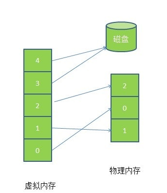

* [死锁](#死锁)
* [内存池](#内存池)
* [进程调度](#进程调度)
* [孤儿进程和僵死进程](#孤儿进程和僵死进程)
* [分页式内存管理](#分页式内存管理)
* [分段式内存管理](#分段式内存管理)
* [段页式内存管理](#段页式内存管理)
* [什么是虚拟内存](#什么是虚拟内存)
* [页面置换算法](#页面置换算法)
* [颠簸](#颠簸)
* [虚拟内存的作用](#虚拟内存的作用)
* [虚拟内存的实现](#虚拟内存的实现)
* [Linux如何避免内存碎片化](#linux如何避免内存碎片化)
* [内部碎片和外部碎片](#内部碎片和外部碎片)
# 死锁
### 死锁产生的条件

### 死锁的避免

# 内存池
内存池是指程序预先从操作系统申请一块足够大内存，此后，当程序中需要申请内存的时候，不是直接向操作系统申请，而是直接从内存池中获取；同理，当程序释放内存的时候，并不是将内存返回给操作系统，而是返回内存池，当程序退出（或者特点时间）时，内存池才将之前申请的内存真正释放。

# 进程调度

# 孤儿进程和僵死进程
1.孤儿进程是怎么产生的？  
一个父进程退出，而它的一个或多个子进程还在运行，这些子进程称为孤儿进程（孤儿进程将由 init 进程收养并对它们完成状态收集工作）

2.僵死进程是怎么产生的？
一个进程 fork 子进程，子进程退出，而父进程没有wait/waitpid子进程，那么子进程的进程描述符仍保存在系统中，这样的进程称为僵尸进程。

3.僵死进程的危害？

4.如何避免僵死进程的产生？

# 什么是虚拟内存
　　虚拟内存允许执行进程不必完全在内存中。虚拟内存的基本思想是：每个进程拥有独立的地址空间，这个空间被分为大小相等的多个块，称为页，每个页都是一段连续的地址。这些页被映射到物理内存，但并不是所有的页都必须在内存中才能运行程序。当程序引用到一部分在物理内存中的地址空间时，由硬件立刻进行必要的映射；当程序引用到一部分不在物理内存中的地址空间时，由操作系统负责将缺失的部分装入物理内存并重新执行失败的命令。这样，对于进程而言，逻辑上似乎有很大的内存空间，实际上其中一部分对应物理内存上的一块（称为帧，通常页和帧大小相等）还有一些没有加载的内存中的对应在硬盘上。
  
　　请求分页系统、请求分段系统、请求段页式系统都是针对虚拟内存的，通过请求实现内存与外存的信息置换。 
  
   
  
 
   
　　由上图可以看出，虚拟内存实际上可以比物理内存大，当访问虚拟内存时，会访问MMU（内存管理单元）去匹配对应的物理地址（比如0，1，2）如果虚拟内存的页并不存在于物理内存中（如 3，4）会产生缺页中断，从磁盘中取得缺得的页存入内存，如果内存已满，还会根据某种算法将磁盘中的页换出。

# 页面置换算法

1.FIFO先进先出算法：在操作系统中经常被用到，比如作业调度  
2.LRU（least recently use）最近最少使用算法：根据使用时间到现在的长短来判断  
3.LFU(least frequently use)最少使用次数算法：根据使用次数来判断  
4.OPT(Optimal replacement)最优置换算法：理论最优，就是要保证置换出去的是不再被使用的页，或者是实际内存中最晚使用的算法

# 颠簸
颠簸本质是指频繁的页调度行为，具体来讲，进程发生缺页中断，这时，必须置换某一页。然而，其他所有的也都在使用，它置换一个页，但立刻再次需要这个页。因此，会不断出现缺页中断，导致整个系统的效率急剧下降，这种现象称为颠簸（抖动）  
内存颠簸的解决策略包括：  
1.如果是因为页面替换策略失误，可以修改替换算法来解决这个问题。  
2.如果是因为运行的程序太多，造成程序无法同时将所有频繁访问的页面调入内存，则要降低多道程序的数量。  
3.否则，还剩下两个办法，终止该进程和增加物理内存容量
# 虚拟内存的作用

# 虚拟内存的实现

# Linux如何避免内存碎片化
1.伙伴算法，用于管理物理内存，避免内存碎片
2.高速缓存Slab层用于管理内核分配内存，避免碎片。

# 内部碎片和外部碎片
在内存管理中，内部碎片是已经被分配出去的内存空间大于请求所需的内存空间。  
外部碎片是指还没有分配出去，但是由于大小太小而无法分配给申请空间的新进程的内存空间空闲快。  
固定分区存在内存碎片，可变式分区分配会存在外部碎片  
页式虚拟存储系统存在内部碎片，段式虚拟存储系统存在外部碎片。  
为了有效的利用内存，使内存产生更少的 碎片，要对内存分页，内存以页为单位来使用，最后一页往往装不满，于是形成了内部碎片  
为了共享要分段，在段的换入换出时形成外部碎片，比如5k的段换出后，有一个4k的段进来放到原来5k的地方，于是形成1k的外部碎片。
