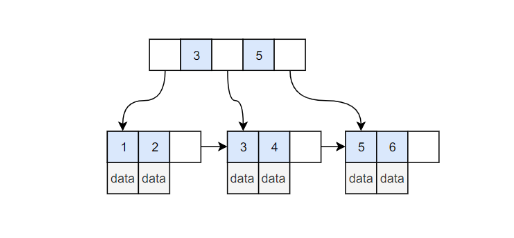

* [一、索引](#一索引)
    * [B+ Tree 原理](#b-tree-原理)
    * [MySQL 索引](#mysql-索引)
    * [索引优化](#索引优化)
    * [索引的优点](#索引的优点)
    * [索引的使用条件](#索引的使用条件)


* [MySQL为什么要用B+树来存储索引而不用hash或者红黑树](#mysql为什么要用b树来存储索引而不用hash或者红黑树)
* [MYSQL的两种存储引擎区别（事务、锁级别等等），各自的适用场景](#mysql的两种存储引擎区别事务锁级别等等各自的适用场景)
* [InnoDB索引和MyISAM索引的区别](#innodb索引和myisam索引的区别)
* [索引有B+索引和hash索引，各自的区别](#索引有b索引和hash索引各自的区别 )
* [B+索引数据结构，和B树的区别](#b索引数据结构和b树的区别)
* [聚集索引和非聚集索引](#聚集索引和非聚集索引的区别)
* [索引分类](#索引分类)
* [索引的优缺点，什么时候使用索引，什么时候不能使用索引](#索引的优缺点什么时候使用索引什么时候不能使用索引)
* [什么是视图？什么是游标](#什么是视图什么是游标)
* [触发器的作用](#触发器的作用)
* [主键和外键的区别？](#主键和外键的区别)
* [在数据库中查询语句速度很慢，如何优化？](#在数据库中查询语句速度很慢如何优化)
* [数据库的乐观锁和悲观锁是什么？](#数据库的乐观锁和悲观锁是什么)
* [简单说一说drop、delete与truncate的区别](#简单说一说dropdelete与truncate的区别)
* [什么是事物？什么是锁？](#什么是事务什么是锁)
* [数据库三范式是什么?](#数据库三范式是什么)
* [SQL约束有哪几种？](#sql约束有哪几种)
* [SQL优化](#sql优化)
# 一、索引
## B+ Tree 原理
B Tree指的是Balance Tree，就是平衡树。平衡树是一棵查找树，并且所有叶子节点位于同一层。  
B+ Tree是基于B Tree和叶子节点顺序访问指针进行实现，它具有B Tree的平衡性，并且通过顺序访问指针来提高区间查询的性能。  
在B+ Tree中，一个节点中的Key从左到右非递减排列，如果某个指针的左右相邻Key分别是Key<sub>i</sub>和Key<sub>i+1</sub>,且不为null，则该指针指向节点的所有Key大于等于Key<sub>i</sub>且小于小于等于Keysub>i+1</sub>。
<div align="center">  </div><br>
进行查找操作时，首先在根节点进行二分查找，找打一个Key所在的指针，然后递归地在指针所指向的节点进行查找。直到查找到叶子节点，然后在叶子节点上进行二分查找，找到Key所对应的data。

插入删除操作会破坏平衡树的平衡性，因此在插入删除操作之后，需要对树进行一个分裂、合并、旋转等操作来维护平衡性。

# MySQL 索引
索引是在存储引擎层实现的，而不是在服务器层实现的，所以不同的存储引擎具有不同的索引类型和实现。

（1）B+ Tree索引  
是大多数MySQL存储引擎的默认索引类型。  

因为不再需要进行全表扫描，只需要对树进行搜索即可，所以查找速度快很多。

除了用于查找，还可以用于排序和分组。  

可以指定多个序列作为索引列，多个索引列共同组成键。

适用于全键值、键值范围和键前缀查找，其中键前缀查找只适用于最前缀查找。如果不是按照索引列的顺序进行查找，则无法使用索引。

InnoDB的B+Tree索引分为索引和辅助索引。主索引的叶子节点data域记录着完整的数据记录，这种索引方式被称为聚簇索引。因为无法把数据行存放在两个不同的地方，所以一个表只能有一个聚簇索引。
<div align="center">  </div><br>
辅助索引的叶子节点的data域记录着主键的值，因此在使用辅助索引进行查找时，需要先查找到主键值，然后再到主索引中进行查找。
<div align="center">  </div><br>
（2）哈希索引
哈希索引能以O(1)时间进行查找，但是失去了有序性：  
无法用于排序与分组。  
只支持精确查找，无法用于部分查找和范围查找。

InnoDB存储引擎有一个特殊的功能叫“自适应哈希索引”，当某个索引值被使用的非常频繁时，会在B+Tree索引上再创建一个哈希索引，这样就让B+Tree索引具有哈希索引的一些优点，比如快速的哈希查找。

（3）MyISAM 存储引擎支持全文索引，用于查找文本中的关键词，而不是直接比较是否相等。

查找条件使用 MATCH AGAINST，而不是普通的 WHERE。

全文索引使用倒排索引实现，它记录着关键词到其所在文档的映射。

InnoDB 存储引擎在 MySQL 5.6.4 版本中也开始支持全文索引。

（4）MyISAM 存储引擎支持空间数据索引（R-Tree），可以用于地理数据存储。空间数据索引会从所有维度来索引数据，可以有效地使用任意维度来进行组合查询。

必须使用 GIS 相关的函数来维护数据。

# 索引优化
### 1. 独立的列

在进行查询时，索引列不能是表达式的一部分，也不能是函数的参数，否则无法使用索引。

例如下面的查询不能使用 actor_id 列的索引：

```sql
SELECT actor_id FROM sakila.actor WHERE actor_id + 1 = 5;
```

### 2. 多列索引

在需要使用多个列作为条件进行查询时，使用多列索引比使用多个单列索引性能更好。例如下面的语句中，最好把 actor_id 和 film_id 设置为多列索引。

```sql
SELECT film_id, actor_ id FROM sakila.film_actor
WHERE actor_id = 1 AND film_id = 1;
```

### 3. 索引列的顺序

让选择性最强的索引列放在前面。

索引的选择性是指：不重复的索引值和记录总数的比值。最大值为 1，此时每个记录都有唯一的索引与其对应。选择性越高，查询效率也越高。

例如下面显示的结果中 customer_id 的选择性比 staff_id 更高，因此最好把 customer_id 列放在多列索引的前面。

```sql
SELECT COUNT(DISTINCT staff_id)/COUNT(*) AS staff_id_selectivity,
COUNT(DISTINCT customer_id)/COUNT(*) AS customer_id_selectivity,
COUNT(*)
FROM payment;
```

```html
   staff_id_selectivity: 0.0001
customer_id_selectivity: 0.0373
               COUNT(*): 16049
```

### 4. 前缀索引

对于 BLOB、TEXT 和 VARCHAR 类型的列，必须使用前缀索引，只索引开始的部分字符。

对于前缀长度的选取需要根据索引选择性来确定。

### 5. 覆盖索引

索引包含所有需要查询的字段的值。

具有以下优点：

- 索引通常远小于数据行的大小，只读取索引能大大减少数据访问量。
- 一些存储引擎（例如 MyISAM）在内存中只缓存索引，而数据依赖于操作系统来缓存。因此，只访问索引可以不使用系统调用（通常比较费时）。
- 对于 InnoDB 引擎，若辅助索引能够覆盖查询，则无需访问主索引。


# 索引的使用条件
大大减少了服务器需要扫描的数据行数。

帮助服务器避免进行排序和分组，以及避免创建临时表（B+Tree 索引是有序的，可以用于 ORDER BY 和 GROUP BY 操作。临时表主要是在排序和分组过程中创建，因为不需要排序和分组，也就不需要创建临时表）。

将随机 I/O 变为顺序 I/O（B+Tree 索引是有序的，会将相邻的数据都存储在一起）。

# 索引的优点
对于非常小的表、大部分情况下简单的全表扫描比建立索引更高效；

对于中到大型的表，索引就非常有效；

但是对于特大型的表，建立和维护索引的代价将会随之增长。这种情况下，需要用到一种技术可以直接区分出需要查询的一组数据，而不是一条记录一条记录地匹配，例如可以使用分区技术。

# MySQL为什么要用B+树来存储索引而不用hash或者红黑树

（1）减少查找次数  

平衡树查找操作的时间复杂度和树高 h 相关，O(h)=O(logdN)，其中 d 为每个节点的出度。  
红黑树的出度为 2，而 B+ Tree 的出度一般都非常大，所以红黑树的树高 h 很明显比 B+ Tree 大非常多，查找的次数也就更多。  
（2）利用磁盘预读特性

为了减少磁盘 I/O 操作，磁盘往往不是严格按需读取，而是每次都会预读。预读过程中，磁盘进行顺序读取，顺序读取不需要进行磁盘寻道，并且只需要很短的旋转时间，速度会非常快。  
操作系统一般将内存和磁盘分割成固定大小的块，每一块称为一页，内存与磁盘以页为单位交换数据。数据库系统将索引的一个节点的大小设置为页的大小，使得一次 I/O 就能完全载入一个节点。并且可以利用预读特性，相邻的节点也能够被预先载入。  
而如果把d值趋向于很大，则此时会变成一个数组，相当于hash，如果只是选取一个数据且内存足够一次性存放所有数据的时候且是hash更优，但是在实际业务场景上我们每次都不是但只选取一个数据且内存都不能满足一次性存放所有数据。  
因此,MySQL使用B+ Tree的的优点是可以一次选取多个数据且分批载入数据。

# MYSQL的两种存储引擎区别（事务、锁级别等等），各自的适用场景 
MYISAM 不支持事务，不支持外键，表锁，插入数据时，锁定整个表，查表总行数时，不需要全表扫描   
INNODB 支持事务，支持外键，行锁，查表总行数时，全表扫描  

# InnoDB索引和MyISAM索引的区别
一是主索引的区别，InnoDB的数据文件本身就是索引文件。而MyISAM的索引和数据是分开的。   
二是辅助索引的区别：InnoDB的辅助索引data域存储相应记录主键的值而不是地址。而MyISAM的辅助索引和主索引没有多大区别。  


# 索引有B+索引和hash索引，各自的区别
hash索引，等值查询效率高,不能排序,不能进行范围查询

B+索引,数据有序, 范围查询

# B+索引数据结构，和B树的区别
1.单一节点存储更多的元素，B+树空间利用率更高，使得查询的IO次数更少  
2.所有查询都要查找叶子节点，查询性能稳定  
3.所有叶子节点形成有序链表，便于范围查询  

# 聚集索引和非聚集索引的区别
聚集索引：数据按索引顺序存储，中子节点存储真实的物理数据  
非聚集索引：存储指向真正数据行的指针

# 索引分类
唯一索引：唯一索引不允许两行具有相同的索引值

主键索引：为表定义一个主键将自动创建主键索引，主键索引是唯一索引的特殊类型。主键索引要求主键中的每个值是唯一的，并且不能为空

聚集索引(Clustered)：表中各行的物理顺序与键值的逻辑（索引）顺序相同，每个表只能有一个

非聚集索引(Non-clustered)：非聚集索引指定表的逻辑顺序。数据存储在一个位置，索引存储在另一个位置，索引中包含指向数据存储位置的指针。可以有多个，小于249个


# 索引的优缺点，什么时候使用索引，什么时候不能使用索引
1.索引最大的好处是提高查询速度  
2.缺点是更新数据时效性低，因为要同时更新索引  
3.对数据进行频繁查询建议建立索引，如果要频繁更改数据不建议使用索引  

什么样的字段适合建索引：唯一、不为空、经常被查询的字段

# 什么是视图？什么是游标？
视图是一种虚拟的表，具有和物理表相同的功能，可以对视图进行增，删，改，查，操作，视图通常是有一个表或者多个表的行或列的子集。对视图的修改不影响基本表，它使得我们能获取数据更容易，相比多表查询。  
只暴露部分字段给访问者，所以就建一个虚表，就是视图。  
查询的数据来源于不同的表，而查询者希望以统一的方式查询，这样也可以建立一个视图，把多个表查询结果联合起来，查询者只需要直接从视图中获取数据，不必考虑数据来源于不同表所带来的差异.    
视图的优点：   
1）对数据库的访问，因为视图可以有选择性的选取数据库里的一部分。   
2 ）用户通过简单的查询可以从复杂查询中得到结果。  
3 ）维护数据的独立性，试图可从多个表检索数据。  
4 ）对于相同的数据可产生不同的视图。  
缺点：  
性能：查询视图时，必须把视图的查询转化成对基本表的查询，如果这个视图是由一个复杂的多表查询所定义，那么就无法更改数据

游标是对查询出来的结果集做一个单元来有效的处理。游标可以定在该单元中的特定行，从结果集当前行检索一行或多行，可以对结果集当前行做修改。一般不使用游标，但是需要逐条处理数据的时候，游标显得十分重要。


# 触发器的作用
触发器是一种特殊的存储过程，主要是通过事件来触发而执行的。它可以强化约束，来维护数据的完整性和一致性，可以跟踪数据库内的操作从而不允许未经许可的更新和变化。可以练级运算。如某表上的触发器上包含对另一个表的数据操作，而该操作又会导致该表触发器被触发。

# 主键和外键的区别？
主键在本表中是唯一的、不可唯空的，外键可以重复可以唯空；外键和另一张表的主键关联，不能创建对应表中不存在的外键。

# 在数据库中查询语句速度很慢，如何优化？
1.建索引   
2.减少表之间的关联  
3.优化sql，尽量让sql很快定位数据，不要让sql做全表查询，应该走索引,把数据 量大的表排在前面  
4.简化查询字段，没用的字段不要，已经对返回结果的控制，尽量返回少量数据  
5.尽量用PreparedStatement来查询，不要用Statement

# 数据库的乐观锁和悲观锁是什么？
数据库管理系统（DBMS）中的并发控制的任务是确保在多个事务同时存取数据库中同一数据时不破坏事务的隔离性和统一性以及数据库的统一性。

乐观并发控制(乐观锁)和悲观并发控制（悲观锁）是并发控制主要采用的技术手段。

悲观锁：假定会发生并发冲突，屏蔽一切可能违反数据完整性的操作  
乐观锁：假设不会发生并发冲突，只在提交操作时检查是否违反数据完整性。  

# 简单说一说drop、delete与truncate的区别
SQL中的drop、delete、truncate都表示删除，但是三者有一些差别

delete和truncate只删除表的数据不删除表的结构  
速度,一般来说: drop> truncate >delete   
delete语句是dml,这个操作会放到rollback segement中,事务提交之后才生效;  
如果有相应的trigger,执行的时候将被触发. truncate,drop是ddl, 操作立即生效,原数据不放到rollback segment中,不能回滚. 操作不触发trigger. 

# 什么是事务？什么是锁？
事务：就是被绑定在一起作为一个逻辑工作单元的SQL语句分组，如果任何一个语句操作失败那么整个操作就被失败，以后操作就会回滚到操作前状态，或者是上一个节点。为了确保要么执行，要么不执行，就可以使用事务。

锁：在所有的DBMS，锁是实现事务的关键，锁可以保证事务的完整性和并发性。与现实生活中锁一样，它可以使某些数据的拥有者，在某段时间内不能使用某些数据或数据结构。当然锁还分级别的。

（1）原子性（Atomicity）
原子性是指事务包含的所有操作要么全部成功，要么全部失败回滚。因此事务的操作如果成功就必须要完全应用到数据库，如果操作失败则不能对数据库有任何影响。

（2）一致性（Consistency）
一致性是指事务必须使数据库从一个一致性状态变换到另一个一致性状态，也就是说一个事务执行前和执行后都必须处于一致性状态。  
```
拿转账来说，假设用户A和用户B两者的钱加起来一共是5000，那么不管A和B之间如何转账，转几次账，事务结束后两个用
户的钱加起来应该还得是5000，这就是事务的一致性
```
（3）隔离性（Isolation）
隔离性是当多个用户并发访问数据库时，比如操作同一张表，数据库为每一个用户开启的事务，不能被其他事务的操作干扰，多个并发事务之间要互相隔离。
```
即要达到这么一种效果：对于任意两个并发的事务T1和T2，在事务T1看来，T2要么在T1开始之前就已经结束，要么在T1结束之后才开始，
这样每个事务都感觉不到有其他事务在并发地执行
```

（4）持久性（Durability）
持久性是指一个事务一旦被提交了 ，那么对数据库中的数据的改变就是永久性的，即使是在数据库系统遇到故障的情况下也不会丢失提交事务的操作。
```
例如我们在使用JDBC操作数据库时，在提交事务方法后，提示用户事务操作完成，当我们程序执行完成直到提示后，
就可以认定事务以及正确提交，即使这时候数据库出现了问题，也必须要将我们的事务完全执行完成，否则就会造
成我们看到提示事务处理完毕，但是数据库因为故障而没有执行事务的重大错误
```
以上介绍完事务的四大特性(简称ACID)，现在重点来说明下事务的隔离性，当多个线程都开启事务操作数据库中的数据时，数据库系统要能进行隔离操作，以保证各个线程获取数据的准确性，在介绍数据库提供的各种隔离级别之前，我们先看看如果不考虑事务的隔离性，会发生的几种问题：  
1.脏读  
脏读是指在一个事务处理过程里读取了另一个未提交的事务中的数据。

当一个事务正在多次修改某个数据，而在这个事务中这多次的修改都还未提交，这时一个并发的事务来访问该数据，就会造成两个事务得到的数据不一致。例如：用户A向用户B转账100元，对应SQL命令如下
```
update account set money=money+100 where name=’B’;  (此时A通知B)

update account set money=money - 100 where name=’A’;
```
当只执行第一条SQL时，A通知B查看账户，B发现确实钱已到账（此时即发生了脏读），而之后无论第二条SQL是否执行，只要该事务不提交，则所有操作都将回滚，那么当B以后再次查看账户时就会发现钱其实并没有转。

2.不可重读
不可重复读是指在对于数据库中的某个数据，一个事务范围内多次查询却返回了不同的数据值，这是由于在查询间隔，被另一个事务修改并提交了。

例如事务T1在读取某一数据，而事务T2立马修改了这个数据并且提交事务给数据库，事务T1再次读取该数据就得到了不同的结果，发送了不可重复读。

不可重复读和脏读的区别是，脏读是某一事务读取了另一个事务未提交的脏数据，而不可重复读则是读取了前一事务提交的数据。

在某些情况下，不可重复读并不是问题，比如我们多次查询某个数据当然以最后查询得到的结果为主。但在另一些情况下就有可能发生问题，例如对于同一个数据A和B依次查询就可能不同，A和B就可能打起来了……

3.虚读（幻读）
幻读是事务非独立执行时发生的一种现象。例如事务T1对一个表中所有的行的某个数据项做了从“1”修改为“2”的操作，这时事务T2又对这个表中插入了一行数据项，而这个数据项的数值还是为“1”并且提交给数据库。而操作事务T1的用户如果再查看刚刚修改的数据，会发现还有一行没有修改，其实这行是从事务T2中添加的，就好像产生幻觉一样，这就是发生了幻读。
幻读和不可重复读都是读取了另一条已经提交的事务（这点就脏读不同），所不同的是不可重复读查询的都是同一个数据项，而幻读针对的是一批数据整体（比如数据的个数）。
现在来看看MySQL数据库为我们提供的四种隔离级别：
① Serializable (串行化)：可避免脏读、不可重复读、幻读的发生。
② Repeatable read (可重复读)：可避免脏读、不可重复读的发生。
③ Read committed (读已提交)：可避免脏读的发生。
④ Read uncommitted (读未提交)：最低级别，任何情况都无法保证。
以上四种隔离级别最高的是Serializable级别，最低的是Read uncommitted级别，当然级别越高，执行效率就越低。像Serializable这样的级别，就是以锁表的方式(类似于Java多线程中的锁)使得其他的线程只能在锁外等待，所以平时选用何种隔离级别应该根据实际情况。在MySQL数据库中默认的隔离级别为Repeatable read (可重复读)。
在MySQL数据库中，支持上面四种隔离级别，默认的为Repeatable read (可重复读)；而在Oracle数据库中，只支持Serializable (串行化)级别和Read committed (读已提交)这两种级别，其中默认的为Read committed级别。
在MySQL数据库中查看当前事务的隔离级别：


#### 事务的作用和使用
事务（Transaction）是并发控制的单位，是用户定义的一个操作序列。这些操作要么都做，要么都不做，是一个不可分割的工作单位。通过事务，SQL Server能将逻辑相关的一组操作绑定在一起，以便服务器保持数据的完整性。主要用于一些对操作过程的完整性比较高的程序。比如银行系统，用户在转账的过程中程序出现错误，但是这个转账操作没有完成。那么这个操作就被退回。

#### 并发和并行
你吃饭吃到一半，电话来了，你一直到吃完了以后才去接，这就说明你不支持并发也不支持并行。  
你吃饭吃到一半，电话来了，你停了下来接了电话，接完后继续吃饭，这说明你支持并发。  
你吃饭吃到一半，电话来了，你一边打电话一边吃饭，这说明你支持并行。  
并发的关键是你有处理多个任务的能力，不一定要同时。  
并行的关键是你有同时处理多个任务的能力。  

# 数据库三范式是什么?
◆ 第一范式（1NF）：强调的是列的原子性，即列不能够再分成其他几列。
考虑这样一个表：【联系人】（姓名，性别，电话）
如果在实际场景中，一个联系人有家庭电话和公司电话，那么这种表结构设计就没有达到 1NF。要符合 1NF 我们只需把列（电话）拆分，即：【联系人】（姓名，性别，家庭电话，公司电话）。1NF 很好辨别，但是 2NF 和 3NF 就容易搞混淆。

◆ 第二范式（2NF）：首先是 1NF，另外包含两部分内容，一是表必须有一个主键；二是没有包含在主键中的列必须完全依赖于主键，而不能只依赖于主键的一部分。
考虑一个订单明细表：【OrderDetail】（OrderID，ProductID，UnitPrice，Discount，Quantity，ProductName）。
因为我们知道在一个订单中可以订购多种产品，所以单单一个 OrderID 是不足以成为主键的，主键应该是（OrderID，ProductID）。显而易见 Discount（折扣），Quantity（数量）完全依赖（取决）于主键（OderID，ProductID），而 UnitPrice，ProductName 只依赖于 ProductID。所以 OrderDetail 表不符合 2NF。不符合 2NF 的设计容易产生冗余数据。
可以把【OrderDetail】表拆分为【OrderDetail】（OrderID，ProductID，Discount，Quantity）和【Product】（ProductID，UnitPrice，ProductName）来消除原订单表中UnitPrice，ProductName多次重复的情况。

◆ 第三范式（3NF）：首先是 2NF，另外非主键列必须直接依赖于主键，不能存在传递依赖。即不能存在：非主键列 A 依赖于非主键列 B，非主键列 B 依赖于主键的情况。
考虑一个订单表【Order】（OrderID，OrderDate，CustomerID，CustomerName，CustomerAddr，CustomerCity）主键是（OrderID）。

第二范式（2NF）和第三范式（3NF）的概念很容易混淆，区分它们的关键点在于，2NF：非主键列是否完全依赖于主键，还是依赖于主键的一部分；3NF：非主键列是直接依赖于主键，还是直接依赖于非主键列。

# SQL约束有哪几种？
NOT NULL: 用于控制字段的内容一定不能为空（NULL）。  
UNIQUE: 控件字段内容不能重复，一个表允许有多个 Unique 约束。  
PRIMARY KEY: 也是用于控件字段内容不能重复，但它在一个表只允许出现一个。  
FOREIGN KEY: 用于预防破坏表之间连接的动作，也能防止非法数据插入外键列，因为它必须是它指向的那个表中的值之一。  
CHECK: 用于控制字段的值范围。  


# SQL优化
选择最有效率的表名顺序  
数据库的解析器按照从右到左的顺序处理FROM子句中的表名，FROM子句中写在最后的表将被最先处理  

在FROM子句中包含多个表的情况下：

如果三个表是完全无关系的话，将记录和列名最少的表，写在最后，然后依次类推  
也就是说：选择记录条数最少的表放在最后  
如果有3个以上的表连接查询：  

如果三个表是有关系的话，将引用最多的表，放在最后，然后依次类推。  
也就是说：被其他表所引用的表放在最后  
例如：查询员工的编号，姓名，工资，工资等级，部门名  

emp表被引用得最多，记录数也是最多，因此放在form字句的最后面
```
select emp.empno,emp.ename,emp.sal,salgrade.grade,dept.dname
from salgrade,dept,emp
where (emp.deptno = dept.deptno) and (emp.sal between salgrade.losal and salgrade.hisal)        
```
WHERE子句中的连接顺序  
数据库采用自右而左的顺序解析WHERE子句,根据这个原理,表之间的连接必须写在其他WHERE条件之左,那些可以过滤掉最大数量记录的条件必须写在WHERE子句的之右。

emp.sal可以过滤多条记录，写在WHERE字句的最右边
```
select emp.empno,emp.ename,emp.sal,dept.dname
      from dept,emp
      where (emp.deptno = dept.deptno) and (emp.sal > 1500) 
```
