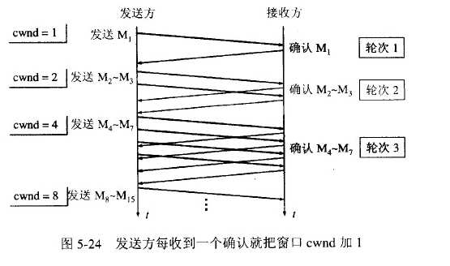
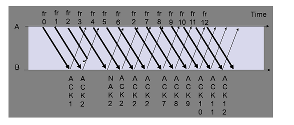
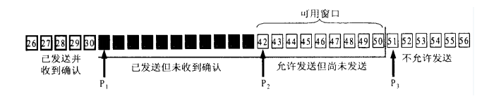
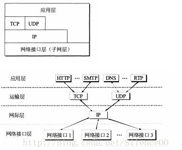

* [TCP三次握手和四次挥手](#tcp三次握手和四次挥手)
* [TCP为什么是四次挥手](#tcp为什么是四次挥手)
* [TCP和UDP的区别](#tcp和udp的区别)
* [字节流服务和数据报服务的区别](#字节流服务和数据报服务的区别)
* [TCP和UPD能否发送0字节的数据包](#tcp和udp能否发送0字节的数据包)
* [为什么说UDP是面向报文的,而TCP是面向字节流的](#为什么说udp是面向报文的而tcp是面向字节流的)
* [TCP流量控制和拥塞控制](#tcp流量控制和拥塞控制)
* [TCP协议如何保证可靠传输](#tcp协议如何保证可靠传输)
* [滑动窗口是什么](#滑动窗口是什么)
* [重传和确认](#重传和确认)
* [7层结构和各自的协议](#7层结构和各自的协议)
* [DNS解析过程](#dns解析过程)
* [Http和Https的区别](#http和https的区别)
* [对称加密和非对称加密](#对称加密和非对称加密)
* [为什么TCP连接需要三次握手，两次不可以吗，为什么？](#为什么tcp连接需要三次握手两次不可以吗为什么)
* [客户端不断进行请求链接会怎样？DDos攻击？](#客户端不断进行请求链接会怎样ddos攻击)
* [Get和Post的区别](#get和post的区别)
* [IP地址的分类](#ip地址的分类)
* [常见状态码及原因](#常见状态码及原因)
* [ARP协议的工作原理](#arp协议的工作原理)
* [子网掩码的作用](#子网掩码的作用)
* [数据链路层的三个基本问题](#数据链路层的三个基本问题)
* [Cookie和Session](#cookie和session)
* [交换机和路由器的区别](#交换机和路由器的区别)
* [二层交换机和三层交换机的区别](#二层交换机和三层交换机的区别)
* [UDP如何实现可靠传输](#udp如何实现可靠传输)
* [TCP三报文握手建立连接时客户端和服务端用的seq序号是共用的吗](#tcp三报文握手建立连接时客户端和服务端用的seq序号是共用的吗)

# TCP三次握手和四次挥手
TCP的运输连接管理

　　TCP是面向连接的协议。运输连接是用来传送TCP报文的。TCP运输连接的建立和释放是每一次面向连接的通信中必不可少的过程。因此，运输连接就有三个阶段，即：连接建立、数据传送和连接释放。运输连接的管理就是使运输连接的建立和释放都能正常地进行。

　　在TCP连接建立过程中要解决以下三个问题：

　　（1）要使每一方能够确知对方的存在

　　（2）要允许双方协商一些参数（如最大窗口值、是否使用窗口扩大选项和时间戳选项以及服务质量等）

　　（3）能够对运输实体资源（如缓存大小、连接表中的项目等）进行分配

　　TCP连接的建立采用客户服务器方式。主动发起连接的建立的应用进程叫做客户（client），而被动等待连接建立的应用进程叫做服务器（server）。

TCP的连接建立

　　TCP建立连接的过程叫做握手，握手    
  <div align="center">  </div><br>

TCP连接释放过程比较复杂，我们仍然结合双方状态的改变来阐明连接释放的过程。

　　数据传输结束后，通信的双方都可以释放连接。现在A和B都处于ESTABLISHED状态。A的应用进程先向其TCP发出连接释放报文段，并停止再发送数据，主动关闭TCP连接。A的应用进程先向其TCP发出连接释放报文段，并停止再发送数据，主动关闭TCP连接。A把连接释放报文段首部的终止控制位FIN置1，其序号seq=u，它等于前面已传送过的数据的最后一个字节的序号加1。这时A进入FIN-WAIT-1（终止等待1）状态，等待B的确定。请注意，TCP规定，FIN报文段即使不携带数据，它也消耗掉一个序号。
  
<div align="center">  </div><br>

　　B收到连接释放报文段后即发出确定，确定号是ack=u+1，而这个报文段自己的序号是v，等于B前面已传送过的数据的最后一个字节的序号加1.然后B就进入CLOSEWAIT（关闭等待）状态。TCP服务器进程这时应通知高层应用进程，因而从A到B这个方向的连接就释放了，这时的TCP连接释放处于半关闭状态，即A已经没有数据要发送了，但 B若发送数据，A仍然要接收。这就是说，从B到A这个方向的连接并未关闭，这个状态可能会持续一段时间。

　　A收到来自B的确认后，就进入FIN-WAIT（终止等待2）状态，等待B发出的连接释放报文段。

　　若B已经没有要向A发送的数据，其应用进程就通知TCP释放连接。这时候B发出的连接释放报文必须使FIN=1.现假定B的序号为w（在半关闭状态B可能又发送一些数据）。B还必须重复上次已发送过的确认号ack=u+1。这时B就进入LAST-ACK（最后确认）状态，等待A的确认。

　　A在收到B的连接释放报文段后，必须对此发出确认。在确认报文段中把ACK置1，确认号ack=w+1，而子集的序号是seq=u+1（根据TCP标准，前面发送过的FIN报文段要消耗一个序号）。然后进入到TIME-WAIT（时间等待）状态。请注意，现在TCP连接还没有释放掉。必须经过时间等待计时器（TIME-WAIT timer）设置的时间2MASL后，ACIA进入到CLOSED状态。时间MSL叫做最长报文段寿命，RFC793建议设为2分钟。但这完全是从 工程上来考虑的，对于现在的网络，MSL=2分钟可能太长了一些。因此TCP允许不同的实现可根据具体情况使用最小的MSL值。因此，从A进入到TIME-WAIT状态后，要经过4分钟才能进入到CLOSED状态，才能开始建立下一个新的连接。当A撤销相应的传输控制块TCB后，就结束了这次的TCP连接。

　　为什么A在TIME-WAIT状态必须等到2MSL的时间？这有两个理由。

答：第一，为了保证A发送的最后一个ACK报文段能够到达B。这个ACK报文段有可能丢失，因而使处在LAST-ACK状态的B收不到对已发送的FIN+ACK报文段的确认。B会超时重传这个FIN+ACK报文段，而A就能在2MSL时间内收到这个重传的FIN+ACK报文段。接着A重传一次确认，重新启动2MSL计时器。（A和B都会启动计时器，如果A 2MSL还未收B发送的报文段就进入CLOSED，而如果B在2MSL时间段内收到了A的报文段就进入CLOSED）最后A和B都正常进入到CLOSED状态。如果A在TIME-WAIT状态不等待一段时间，而是在发送完ACK报文段后立即释放连接，那么就无法收到B重传的FIN+ACK报文段，因而不会再发送一次 确认报文段。这样，B就无法按照正常步骤进入CLOSED状态。

　　第二，防止上一节提到的“已失效的连接请求报文段”出现在本连接中。A在发送完最后一个ACK报文段后，再经过2MSL，就可以使本连接持续的时间内所产生的所有报文段都从网络中 消失。这样就可以使下一个新的连接中不会出现这种旧的连接请求报文段。

　　B只有收到了A发出的确认，就进入CLOSED状态。同样，B在撤销相应的传输控制块TCB后就结束了这次的TCP连接。我们注意到，B结束TCP连接的时间比A早一些。

 

### 出现太多TIME_WAIT可能导致的后果：  

   在高并发短连接的TCP服务器上，当服务器处理完请求后立刻按照主动正常关闭连接。这个场景下，会出现大量socket处于TIMEWAIT状态。如果客户端的并发量持续很高，此时部分客户端就会显示连接不上。
我来解释下这个场景。主动正常关闭TCP连接，都会出现TIMEWAIT。为什么我们要关注这个高并发短连接呢？有两个方面需要注意：

 ① 高并发可以让服务器在短时间范围内同时占用大量端口，而端口有个0~65535的范围，并不是很多，刨除系统和其他服务要用的，剩下的就更少了。  
 ②在这个场景中，短连接表示“业务处理+传输数据的时间 远远小于 TIMEWAIT超时的时间”的连接。这里有个相对长短的概念，比如，取一个web页面，1秒钟的http短连接处理完业务，在关闭连接之后，这个业务用过的端口会停留在TIMEWAIT状态几分钟，而这几分钟，其他HTTP请求来临的时候是无法占用此端口的。单用这个业务计算服务器的利用率会发现，服务器干正经事的时间和端口（资源）被挂着无法被使用的时间的比例是 1：几百，服务器资源严重浪费。（说个题外话，从这个意义出发来考虑服务器性能调优的话，长连接业务的服务就不需要考虑TIMEWAIT状态。同时，假如你对服务器业务场景非常熟悉，你会发现，在实际业务场景中，一般长连接对应的业务的并发量并不会很高）  
           综合这两个方面，持续的到达一定量的高并发短连接，会使服务器因端口资源不足而拒绝为一部分客户服务。
### 怎么解决太多TIME_WAIT
目前看来最好的办法是让每个TIME_WAIT早点过期。

在linux上可以这么配置：
```
#让TIME_WAIT状态可以重用，这样即使TIME_WAIT占满了所有端口，也不会拒绝新的请求造成障碍
echo "1" > /proc/sys/net/ipv4/tcp_tw_reuse
#让TIME_WAIT尽快回收，我也不知是多久，观察大概是一秒钟
echo "1" > /proc/sys/net/ipv4/tcp_tw_recycle
```
很多文档都会建议两个参数都配置上，但是我发现只用修改tcp_tw_recycle就可以解决问题的了，TIME_WAIT重用TCP协议本身就是不建议打开的。 

不能重用端口可能会造成系统的某些服务无法启动，比如要重启一个系统监控的软件，它用了40000端口，而这个端口在软件重启过程中刚好被使用了，就可能会重启失败的。

# TCP为什么是四次挥手
因为收到对方的FIN报文通知时，它仅仅表示对方没有数据发送给你了，但未必你所有的数据都全部发送对方了，所以你可能还需要发送一些数据给对方，再发送FIN报文给对方表示你同意现在可以关闭连接了，故这里的ACK报文和FIN报文多数情况下都是分开发送的，也就造成4次挥手。

# TCP和UDP的区别
1.TCP面向连接，UDP是无连接的，即发送数据之前不需要建立连接。  
2.TCP提供可靠的服务。也就是说，通过TCP连接发送的数据，无差错，不丢失，不重复，且按序到达;UDP尽最大努力交付，即不保证可靠交付。  
3.TCP面向字节流，实际上是TCP把数据看成一串无结构的字节流；UDP是面向报文的，UDP没有拥塞控制，因此网络出现拥塞不会使源主机的发送速率降低（对实际应用很有用，如IP电话，实时视频会议等）  
4.每一条TCP连接只能是点到点的；UDP支持一对一，一对多，多对一和多对多的交互通信。  
5.TCP首部开销20字节；UDP首部开销8字节。  
 
# 字节流服务和数据报服务的区别
　　这种区别应用到实际编程中，则体现为通信双方是否必须执行相同次数的读、写。当发送端应用程序连续执行多次写操作时，TCP模块先将这些数据放入TCP发送缓冲区中。当TCP模块真正开始发送数据时，发送缓冲区中这些等待发送的数据可能被封装成一个或多个TCP报文段发出。因此，TCP模块发送出去的TCP报文段的个数和应用程序执行的写操作次数之间没有固定的数量关系。  
　　当接收端收到一个或多个TCP报文段后，TCP模块将它们携带的应用程序数据按照TCP报文段的序号依次放入TCP接收缓冲区中，并通知应用程序读取数据。接收端应用程序可以一次性将TCP接收缓冲区中的数据全部读取出来，也可以分多次读取，这取决于用户指定的应用程序读缓冲区的大小。因此，应用程序执行的读操作次数和TCP模块接收到的TCP报文段个数之间也没有固定的数量关系。  
　　综上所述，发送端执行的写操作次数和接收端执行的读操作次数之间没有任何数量关系，这就是字节流的概念：应用程序对数据的发送和接收是没有边界限制的。UDP则不然。发送端应用程序每执行一次写操作，UDP模块就将其封装成一个UDP数据报并发送出去。接收端必须及时针对每一个UDP数据报执行读操作，否则就会丢失包（这经常发生在较慢的服务器上）。并且，如果用户没有指定足够的应用程序缓冲区来读取UDP数据，则UDP数据将被截断。

# TCP和UDP能否发送0字节的数据包
TCP和UDP都能发送0字节的数据包，但是用TCP发送的话接收端是不能收到0字节的数据包的，而用UDP发送的话接收端是可以收到0字节的数据包的。原因在于TCP有缓冲区，而UDP没有。TCP面对应用层下来的数据会先存放于TCP发送缓冲区中，然后再对数据进行分组处理等，最后再发送出去，所以如果应用层下来的数据是0字节存放到TCP发送缓冲区中并不会发送出去，而是可能积累一定量数据后再启动发送。而UDP面对应用层下来的数据只是加上UPD报头然后传给下一层，并不会对包中数据进行处理，所以不管上面传下来什么数据都会被发送出去。

# 为什么说UDP是面向报文的,而TCP是面向字节流的
1.UDP是面向报文的，发送方的UDP对应用层交下来的报文，不合并，不拆分，只是在其上面加上首部后就交给了下面的网络层，也就是说无论应用层交给UDP多长的报文，它统统发送，一次发送一个。而对接收方，接到后直接去除首部，交给上面的的应用层就完成任务了。因此，它需要应用层控制报文的大小。  
2.TCP是面向字节流的，它把上面应用层交下来的数据看成是无结构的字节流来发送，可以想象成流水形式的，发送方TCP会将数据放入“蓄水池”(缓存区)，等到可以发送的时候就发送，不能发送就等着，TCP会根据当前网络的拥塞状态来确定每个报文段的大小。  


# TCP流量控制和拥塞控制
## TCP的流量控制
　　所谓的流量控制就是让发送方的发送速率不要太快，让接收方来得及接收。利用滑动窗口机制可以很方便的在TCP连接上实现对发送方的流量控制。TCP的窗口单位是字节，不是报文段，发送方的发送窗口不能超过接收方给出的接收窗口的数值。  
    <div align="center">  </div><br>
　　如图所示，说明了利用可变窗口大小进行流量控制。设主机A向B发送数据。双方确定的窗口值是400，再设每一个报文段为100字节长，序号的初始值为seq=1，图中的箭头上面大写ACK，表示首部中的确认位为ACK，小写ack表示确认字段的值。    
　　接收方的主机B进行了三次流量控制。第一次把窗口设置为rwind=300，第二次减少到rwind=100，最后减到rwind=0，即不允许发送方再发送数据了。这种使发送方暂停发送的状态将持续到主机B重新发送出一个新的窗口值为止。  
　　假如，B向A发送了零窗口的报文段后不久，B的接收缓存又有了一些存储空间，于是B向A发送了rwind=400的报文段，然而这个报文段在传送中丢失了。A一直等待收到B发送的非零窗口的通知，而B也一直等待A发送的数据。这样就死锁了。为了解决这种死锁，TCP为每个连接设有一个持续计时器。只要TCP连接的一方收到对方的零窗口通知，就启动持续计时器，若持续计时器设置的时间到期了，就发送一个零窗口探测报文段（仅携带1字节的数据），而对方就在确认这个探测报文段时给出了现在的窗口值。  

## TCP报文段发送时机的选择
　　TCP报文段发送时机主要有以下几种选择途径。  
　　1）TCP维持一个变量，它等于最大报文段长度MSS，只要缓存中存放的数据达到MSS字节就组成一个TCP报文段发送出去。  
　　2）由发送方的应用程序指明要求发送报文段，即TCP支持的推送操作。  
　　3）是发送方的一个计时期限到了，这时候就把当前已有的缓存数据装入报文段发送出去。  
## Nagle算法
　　若发送应用进程把要发送的数据逐个字节地送到TCP的发送缓存，则发送方就把第一个数据字节先发送出去，把后面到达的数据字节都缓存起来。当发送方接收对第一个数据字符的确认后，再把发送缓存中的所有数据组装成一个报文段再发送出去，同时继续对随后到达的数据进行缓存。只有在收到对前一个报文段的确认后才继续发送下一个报文段。当数据到达较快而网络速率较慢时，用这样的方法可明显地减少所用的网络带宽。Nagle算法还规定：当到达的数据已达到发送窗口大小的一半或已达到报文段的最大长度时，就立即发送一个报文段。  
## 糊涂窗口综合征
　　TCP接收方的缓存已满，而交互的应用进程一次只从接收缓存中读取1字节（这样就使接收缓存空间仅腾出1字节），然后向发送方发送确认，并把窗口设置为1字节（但发送的的数据报为40字节的话），接收，发送方又发来1字节的数据（发送方的IP数据报是41字节）。接收方发回确认，仍然将窗口设置为1.这样，网络的效率很低。要解决这个问题，可让接收方等待一段时间，使得或者接收缓存已有足够空间容纳一个最长的报文段，或者等到接收方缓存已有一半空闲的空间。只要出现这两种情况，接收方就发回确认报文，并向发送方通知当前的窗口大小，此外，发送方也不要发送太小的报文段，而是把数据积累成足够大的报文段，或达到接收方缓存的空间的一半大小。
## TCP的拥塞控制
1.拥塞：即对资源的需求超过了可用的资源。若网络中许多资源同时供应不足，网络的性能就要明显变坏，整个网络的吞吐量随之负荷的增大而下降。  
　　拥塞控制：防止过多的数据注入到网络中，这样可以使网络中的路由器或链路不致过载。拥塞控制所要做的都有一个前提：网络能够承受现有的网络负荷。拥塞控制是一个全局性的过程，涉及到所有的主机、路由器，以及与降低网络传输性能有关的所有因素。  
　　流量控制：指点对点通信的控制，是端到端的问题。流量控制所要做的是抑制发送端发送数据的速率，以便使接收端来得及接收。  
　　拥塞控制的代价：需要获得网络内部流量分布信息。在实施拥塞控制之前，还需要在结点之间交换信息和各种命令，以便选择控制的策略和实施控制。这样就产生了额外的开销。拥塞控制还需要将一些资源分配给各个用户单独使用，使得网络资源不能更好的实现共享。      
2.几种拥塞控制的方法  
　　慢开始、拥塞避免、快重传和快恢复  
2.1慢开始和拥塞避免  
　　发送方维持一个拥塞窗口cwnd的状态变量。拥塞窗口的大小取决于网络的拥塞程度，并且动态地在变化。发送方让自己的发送窗口等于拥塞。  

　　发送方控制拥塞窗口的原则是：只要网络没有出现拥塞，拥塞窗口就再增大一些，以便把更多的分组发送出去。但只要网络出现拥塞，拥塞窗口就减少一些，以减少注入到网络中的分组数。

　　慢开始算法：当主机开始发送数据时，如果立即把大量的数据注入到网络，那么就有可能引起网络拥塞，因为现在并不清楚网络的负荷情况。因此，较好的方法是先探测一下，即由小到大逐渐增大发送窗口，也就是说，由小到大逐渐增大拥塞窗口数值。通常在刚刚开始发送数据报文段时，先把拥塞窗口cwnd设置为一个最大报文段MSS的数值。而在每收到一个对新的报文段的确认后，把拥塞窗口增加至多个MSS的数值。用这样的方法逐步增大发送方的拥塞窗口cwnd，可以使分组注入到网络的速率更加合理。  
   <div align="center">  </div><br>
　　每经过一个传输轮次，拥塞窗口cwnd就加倍。一个传输轮次所经历的时间其实就是往返时间RTT。不过“传输轮次”更加强调：把拥塞窗口cwnd所允许发送的报文段都连续发送出去，并收到了对已发送的最后一个字节的确认。
  
　　慢开始的“慢”并不是指cwnd的增长速率慢，而是指在TCP开始发送报文段时先设置cwnd=1，使得发送方在开始时只发送一个报文段（目的是试探一下网络的拥塞情况），然后再逐渐增大cwnd。

　　为了防止拥塞窗口cwnd增长过大引起的网络拥塞，还需要设置一个开始门限ssthresh状态变量（如何设置ssthresh）。慢开始门限ssthresh的用法如下：
　　当cwnd<ssthresh时，使用上述的慢开始算法。  
　　当cwnd>ssthresh时，停止使用慢开始算法而改用拥塞避免算法。
　　当cwnd=ssthresh时，即可使用慢开始算法，也可使用拥塞避免算法。
　　拥塞避免算法：让拥塞窗口cwnd缓慢地增大，即每经过一个往返时间RTT就把发送方的拥塞窗口cwnd加1，而不是加倍，这样拥塞避免窗口cwnd按线性规律缓慢增长，比慢开始算法的拥塞窗口增长速率缓慢得多。
  
　　无论在慢开始阶段还是在拥塞避免阶段，只要发送方判断网络出现拥塞（其根据就是没有收到确认），就把慢开始门限ssthresh设置为出现拥塞时的发送方窗口值的一半（但不能小于2）。然后把拥塞窗口cwnd重新设置为1，执行慢开始算法，这样做的目的就是要迅速减少主机发送到网络中的分组数，使得发生拥塞的路由器有足够的时间把队列中积压的分组处理完毕。

　　如下图，用具体数值说明了上述拥塞控制过程。现在发送拥塞窗口的大小和拥塞窗口一样大。
  
   <div align="center">  </div><br>
  
## 快重传和快恢复
　　快重传和快恢复旨在快速恢复丢失的数据包。  
快重传：    
　　没有快速重传和快速恢复，TCP将会使用定时器来要求传输暂停。在暂停这段时间内，没有新的包被发送。  
首先对于接收方来说，如果接收方收到一个失序的报文段，就立即回送一个ACK给发送方，而不是等一会然后发送延时的ACK，所谓失序的报文是指，用户没有按照顺序收到TCP报文段，比如接收方收到报文M1，M2，M4，那么M4就称为失序报文。这样做的目的是可以让发送方尽可能早知道报文段M3未到达接收方；  
快重传算法规定，如果发送方一连收到3个重复的确认，就应该立即传送对方未收到的报文M3，而不必等待M3的重传计时器到期。    
<div align="center">  </div><br>    
快恢复：

　　在慢启动和拥塞算法中，我们可以知道，一旦出现超时重传，TCP就会把慢启动门限ssthresh的值设置为cwndd值的一半，同时cwnd设置成1；    
但是快恢复不这样做，一旦出现超时重传，或者受到三个重复的ack时（快重传），TCP会把慢启动门限ssthresh的值设置为cwnd值的一半，同时cwnd=ssthresh  

# TCP协议如何保证可靠传输
数据包校验：目的是检测数据在传输过程中的任何变化，若校验出包有错，则丢弃报文段并且不给出响应，这时TCP发送数据端超时后会重发数据；

对失序数据包重排序：既然TCP报文段作为IP数据报来传输，而IP数据报的到达可能会失序，因此TCP报文段的到达也可能会失序。TCP将对失序数据进行重新排序，然后才交给应用层；

丢弃重复数据：对于重复数据，能够丢弃重复数据；

应答机制：当TCP收到发自TCP连接另一端的数据，它将发送一个确认。这个确认不是立即发送，通常将推迟几分之一秒；

超时重发：当TCP发出一个段后，它启动一个定时器，等待目的端确认收到这个报文段。如果不能及时收到一个确认，将重发这个报文段；

流量控制：TCP连接的每一方都有固定大小的缓冲空间。TCP的接收端只允许另一端发送接收端缓冲区所能接纳的数据，这可以防止较快主机致使较慢主机的缓冲区溢出，这就是流量控制。TCP使用的流量控制协议是可变大小的滑动窗口协议。

# 滑动窗口是什么
　　为什么要使用滑动窗口？  
　　因为发送端希望在收到确认前，继续发送其他报文段。比如说在收到0号报文的确认前还发出了1——3号的报文，这样提高了信道的利用率。但可以想象，0——4发出去后可能要重传，所以需要一个缓冲区维护这些报文，所以就有了滑动窗口。  
  <div align="center">  </div><br>  
RTT：往返时间  
窗口是什么？  
接收窗口：   
  <div align="center">  </div><br>  
　　“接收窗口”大小取决于应用、系统、硬件的限制。图中，接收窗口是31~50，大小为20. 
  
　　在接收窗口中，黑色的表示已收到的数据，白色表示未接收到的数据。 
  
　　当收到窗口左边的数据，如27，则丢失，因为这部分已经交付给主机；
  
　　当收到窗口左边的数据，如52，则丢失，因为还没轮到它； 
  
　　当收到已收到的窗口中的数据，如32，丢弃；    
  
　　当收到未收到的窗口中的数据，如35，缓存在窗口中。   
  
发送窗口：    
<div align="center">  </div><br>  
　　发送窗口的大小swnd=min(rwnd,cwnd)。rwnd是接收窗口，cwnd用于拥塞控制，暂时可以理解为swnd=rwnd=20.    
　　图中分为四个阶段，其中P1到P3是发送窗口。    
  tips：发送窗口以字节为单位。为了方便画图，图中展示得像以报文为单位一样。但这不影响理解。    
  
  TCP滑动窗口具体是怎样的？（知乎上是解释）
  https://www.zhihu.com/question/32255109
  
# 重传和确认
什么时候发确认：这是一个复杂的策略。我们这里先简单地认为每收到一个报文就发送一个确认。  
怎么确认（累计确认）：  
情况1：发送ack=31（为什么这个也要发，这个确认可以用于后面的拥塞控制）  
<div align="center">  </div><br>  
情况2:发送ack34，并把接收窗口左边缘设置成34，右边缘设置成53  
<div align="center">  </div><br>  
累计确认的好处：情况1中ack=31比描述收到32和33简单；坏处：可能要重传已接收的数据。  
发送方收到确认时怎么处理：  
<div align="center">  </div><br>  
情况1：收到ack=31，什么都不做，或者说继续发送可用窗口中的内容，如42~50

情况2：收到ack=34，发送窗口的左边缘设置成34，右边缘设置成53.

什么时候重传：因为每个报文都有超时计数器，超时才重传。超时重传时间的选择也是一个策略。  

tcp缓存和窗口的关系：窗口是缓存的一部分。  
发送缓存=发送窗口（已经发送出去部分）+P3右边的一部分（准备发送部分）。  
接收缓存=接收窗口（已经接收到但还未确认）+部分已确认但主机还没处理完的数据。 

# 7层结构和各自的协议
OSI七层协议模型主要是：应用层，表示层，会话层，传输层，网络层，物理层，链路层  
TCP/IP四层模型：TCP/IP是一个四层的体系结构，主要包括：应用层，运输层，网际层和网络接口层。从实质上讲，只有上边三层，网络接口层没有什么具体的内容。

<div align="center">  </div><br>  

三、五层体系结构
五层体系结构包括：应用层、运输层、网络层、数据链路层和物理层。 
五层协议只是OSI和TCP/IP的综合，实际应用还是TCP/IP的四层结构。为了方便可以把下两层称为网络接口层。

三种模型结构： 
<div align="center">  </div><br>  

各层的作用
1、物理层：
主要定义物理设备标准，如网线的接口类型、光纤的接口类型、各种传输介质的传输速率等。它的主要作用是传输比特流（就是由1、0转化为电流强弱来进行传输,到达目的地后在转化为1、0，也就是我们常说的数模转换与模数转换）。这一层的数据叫做比特。 　　

2、数据链路层：
定义了如何让格式化数据以进行传输，以及如何让控制对物理介质的访问。这一层通常还提供错误检测和纠正，以确保数据的可靠传输。 　　

3、网络层：
在位于不同地理位置的网络中的两个主机系统之间提供连接和路径选择。Internet的发展使得从世界各站点访问信息的用户数大大增加，而网络层正是管理这种连接的层。 　　

4、运输层：
定义了一些传输数据的协议和端口号（WWW端口80等），如： 
TCP（transmission control protocol –传输控制协议，传输效率低，可靠性强，用于传输可靠性要求高，数据量大的数据） 
UDP（user datagram protocol–用户数据报协议，与TCP特性恰恰相反，用于传输可靠性要求不高，数据量小的数据，如QQ聊天数据就是通过这种方式传输的）。 主要是将从下层接收的数据进行分段和传输，到达目的地址后再进行重组。常常把这一层数据叫做段。 　　

5、会话层：
通过运输层（端口号：传输端口与接收端口）建立数据传输的通路。主要在你的系统之间发起会话或者接受会话请求（设备之间需要互相认识可以是IP也可以是MAC或者是主机名） 　　

6、表示层：
可确保一个系统的应用层所发送的信息可以被另一个系统的应用层读取。例如，PC程序与另一台计算机进行通信，其中一台计算机使用扩展二一十进制交换码（EBCDIC），而另一台则使用美国信息交换标准码（ASCII）来表示相同的字符。如有必要，表示层会通过使用一种通格式来实现多种数据格式之间的转换。 　　

7、应用层：
是最靠近用户的OSI层。这一层为用户的应用程序（例如电子邮件、文件传输和终端仿真）提供网络服务。

# DNS解析过程
网络客户端就是我们平常使用的电脑，打开浏览器，输入一个域名。比如 ：www.163.com ，这时，你使用的电脑会发出一个DNS请求到本地服务器。本地DNS服务器一般都是你的网络接入服务器商提供，比如中国电信，中国移动。

查询www.163.com 的DNS请求到达本地DNS服务器之后，本地DNS服务器会首先查询它的缓存记录，如果缓存中有此条记录，就可以直接返回结果。如果没有，本地DNS服务器还要向DNS根服务器进行查询。

根DNS服务器没有记录具体的域名和IP地址的对应关系，而是告诉本地DNS服务器，你可以到域服务器上去继续查询，并给出域服务器的地址。

本地DNS服务器继续向域服务器发出请求，在这个例子中，请求的对象是.com域服务器。.com域服务器收到请求之后，也不会直接返回域名和IP地址的对应关系，而是告诉本地DNS服务器，你的域名的解析服务器的地址。

最后，本地DNS服务器向域名的解析服务器发出请求，这时就能收到一个域名和IP地址对应关系，本地DNS服务器不仅要把IP地址返回给用户电脑，还要把这个对应关系保存在缓存中，以备下次别的用户查询时，可以直接返回结果，加快网络访问。


# Http和Https的区别
Http协议运行在TCP上，明文传输，客户端与服务端都无法验证对方的身份，Https是身披SSL外壳的Http，运行在SSL上，SSL运行在TCP之上，是添加了加密和认证机制的HTTP。两者之间存在如下不同：  
1.端口不同：Http与HTttps使用不同的连接方式，用的端口也不一样，前者是80，后者是443  
2.资源消耗：和http通信相比，https通信会由于加密处理消耗更多的CPU和内存资源  
3.开销：https通信需要证书，而证书一般需要向认证机构购买  
HTTPS的加密机制是一种共享密钥加密和公开密钥加密并用的混合加密机制  

# 对称加密和非对称加密
对称密钥加密是指加密和解密使用同一个密钥的方式，这种方式存在的最大的问题就是密钥发送问题，即如何安全地将密钥发送给对方，而非对称加密是指使用一对非对称密钥，即公钥和私钥，公钥可以随意发布，但私钥只有用户自己知道。发送密文的一方使用对方的公钥进行加密处理，对方接收到加密信息后，使用自己的私钥进行解密。

由于非对称加密的方式不需要发送用来解密的私钥，所以可以保证安全性，但是和对称加密比起来，它非常的慢，所以我们还是要用对称加密来发送信息，但对称加密使用的密钥我们可以通过非对称加密的方式发送出去。

# 为什么TCP连接需要三次握手，两次不可以吗，为什么？
为了防止 已失效的链接请求报文突然又传送到了服务端，因而产生错误。

　　客户端发出的连接请求报文并未丢失，而是在某个网络节点长时间滞留了，以致延误到链接释放以后的某个时间才到达Server。这是，Server误以为这是Client发出的一个新的链接请求，于是就向客户端发送确认数据包，同意建立链接。若不采用“三次握手”，那么只要Server发出确认数据包，新的链接就建立了。由于client此时并未发出建立链接的请求，所以其不会理睬Server的确认，也不与Server通信；而这时Server一直在等待Client的请求，这样Server就白白浪费了一定的资源。若采用“三次握手”，在这种情况下，由于Server端没有收到来自客户端的确认，则就会知道Client并没有要求建立请求，就不会建立链接。

# 客户端不断进行请求链接会怎样？DDos攻击？
服务器端会为每个请求创建一个链接，并向其发送确认报文，然后等待客户端进行确认
1)、DDos 攻击

客户端向服务端发送请求链接数据包
服务端向客户端发送确认数据包
客户端不向服务端发送确认数据包，服务器一直等待来自客户端的确认
2)、DDos 预防 ( 没有彻底根治的办法，除非不使用TCP )

限制同时打开SYN半链接的数目
缩短SYN半链接的Time out 时间
关闭不必要的服务

# Get和Post的区别
GET与POST是我们常用的两种HTTP Method，二者之间的区别主要包括如下五个方面：

(1). 从功能上讲，GET一般用来从服务器上获取资源，POST一般用来更新服务器上的资源；

(2). 从REST服务角度上说，GET是幂等的，即读取同一个资源，总是得到相同的数据，而POST不是幂等的，因为每次请求对资源的改变并不是相同的；进一步地，GET不会改变服务器上的资源，而POST会对服务器资源进行改变；

(3). 从请求参数形式上看，GET请求的数据会附在URL之后，即将请求数据放置在HTTP报文的 请求头 中，以?分割URL和传输数据，参数之间以&相连。特别地，如果数据是英文字母/数字，原样发送；否则，会将其编码为 application/x-www-form-urlencoded MIME 字符串(如果是空格，转换为+，如果是中文/其他字符，则直接把字符串用BASE64加密，得出如：%E4%BD%A0%E5%A5%BD，其中％XX中的XX为该符号以16进制表示的ASCII)；而POST请求会把提交的数据则放置在是HTTP请求报文的 请求体 中。

(4). 就安全性而言，POST的安全性要比GET的安全性高，因为GET请求提交的数据将明文出现在URL上，而且POST请求参数则被包装到请求体中，相对更安全。

(5). 从请求的大小看，GET请求的长度受限于浏览器或服务器对URL长度的限制，允许发送的数据量比较小，而POST请求则是没有大小限制的。


# IP地址的分类
IP地址是指互联网协议地址，是IP协议提供的一种统一的地址格式，它为互联网上的每一个网络和每一台主机分配一个逻辑地址，以此来屏蔽物理地址的差异。IP地址编址方案将IP地址空间划分为A、B、C、D、E五类，其中A、B、C是基本类，D、E类作为多播和保留使用，为特殊地址。

　　每个IP地址包括两个标识码（ID），即网络ID和主机ID。同一个物理网络上的所有主机都使用同一个网络ID，网络上的一个主机（包括网络上工作站，服务器和路由器等）有一个主机ID与其对应。A~E类地址的特点如下：

A类地址：以0开头，第一个字节范围：0~127；

B类地址：以10开头，第一个字节范围：128~191；

C类地址：以110开头，第一个字节范围：192~223；

D类地址：以1110开头，第一个字节范围为224~239；

E类地址：以1111开头，保留地址

1). A类地址：1字节的网络地址 + 3字节主机地址，网络地址的最高位必须是“0”

　　一个A类IP地址是指， 在IP地址的四段号码中，第一段号码为网络号码，剩下的三段号码为本地计算机的号码。如果用二进制表示IP地址的话，A类IP地址就由1字节的网络地址和3字节主机地址组成，网络地址的最高位必须是“0”。A类IP地址中网络的标识长度为8位，主机标识的长度为24位，A类网络地址数量较少，有126个网络，每个网络可以容纳主机数达1600多万台。

　　A类IP地址的地址范围1.0.0.0到127.255.255.255（二进制表示为：00000001 00000000 00000000 00000000 - 01111110 11111111 11111111 11111111），最后一个是广播地址。A类IP地址的子网掩码为255.0.0.0，每个网络支持的最大主机数为256的3次方-2=16777214台。

2). B类地址: 2字节的网络地址 + 2字节主机地址，网络地址的最高位必须是“10”

　　一个B类IP地址是指，在IP地址的四段号码中，前两段号码为网络号码。如果用二进制表示IP地址的话，B类IP地址就由2字节的网络地址和2字节主机地址组成，网络地址的最高位必须是“10”。B类IP地址中网络的标识长度为16位，主机标识的长度为16位，B类网络地址适用于中等规模的网络，有16384个网络，每个网络所能容纳的计算机数为6万多台。

　　B类IP地址地址范围128.0.0.0-191.255.255.255（二进制表示为：10000000 00000000 00000000 00000000—-10111111 11111111 11111111 11111111），最后一个是广播地址。B类IP地址的子网掩码为255.255.0.0，每个网络支持的最大主机数为256的2次方-2=65534台。

3). C类地址: 3字节的网络地址 + 1字节主机地址，网络地址的最高位必须是“110”

　　一个C类IP地址是指，在IP地址的四段号码中，前三段号码为网络号码，剩下的一段号码为本地计算机的号码。如果用二进制表示IP地址的话，C类IP地址就由3字节的网络地址和1字节主机地址组成，网络地址的最高位必须是“110”。C类IP地址中网络的标识长度为24位，主机标识的长度为8位，C类网络地址数量较多，有209万余个网络。适用于小规模的局域网络，每个网络最多只能包含254台计算机。

　　C类IP地址范围192.0.0.0-223.255.255.255（二进制表示为: 11000000 00000000 00000000 00000000 - 11011111 11111111 11111111 11111111）。C类IP地址的子网掩码为255.255.255.0，每个网络支持的最大主机数为256-2=254台。

4). D类地址:多播地址，用于1对多通信，最高位必须是“1110”

　　D类IP地址在历史上被叫做多播地址(multicast address)，即组播地址。在以太网中，多播地址命名了一组应该在这个网络中应用接收到一个分组的站点。多播地址的最高位必须是“1110”，范围从224.0.0.0到239.255.255.255。

5). E类地址:为保留地址，最高位必须是“1111”

# 常见状态码及原因
HTTP请求结构： 请求方式 + 请求URI + 协议及其版本 
　　HTTP响应结构： 状态码 + 原因短语 + 协议及其版本

1×× : 请求处理中，请求已被接受，正在处理  
2×× : 请求成功，请求被成功处理   
200 OK  
3×× : 重定向，要完成请求必须进行进一步处理   
301 : 永久性转移   
302 ：暂时性转移   
304 ： 已缓存  
4×× : 客户端错误，请求不合法   
400：Bad Request,请求有语法问题   
403：拒绝请求   
404：客户端所访问的页面不存在  
5×× : 服务器端错误，服务器不能处理合法请求   
500 ：服务器内部错误   
503 ： 服务不可用，稍等   

# ARP协议的工作原理
ARP为IP地址到对应的硬件地址之间提供动态映射。ARP的功能主要是将逻辑的IP地址转化为对应的物理地址。

ARP 高效运作的关键是由于每个主机上都有 个 ARP 速缓存。这个高速缓存存放的是最近Internet地址到硬件地址之间的映射记录。高速缓存中每一项的存时间般为20分钟，起始时间从被创建时开始算起。

48 bit的以太地址 6个十 六进制的数来表示，中间以冒号隔开。

ARP地址解析过程：

1.当主机A需要向本局域网的机器B发送数据报文时候，需要在其ARP高速缓冲区查看是否有无主机B的IP地址，如果有，就将他的对应硬件地址取出，再将这个地址写入到MAC帧，然后通过局域网把该MAC帧发往此硬件地址。

如果没有需要进行广播请求：

1.广播发送一个ARP请求分组，然后写入A的IP地址和硬件地址，还有B的IP地址进行询问B的硬件地址

2.本局域网上的所有主机接收到ARP广播分组

3.主机B收到ARP分组，并向A返回自己的硬件地址和IP，局域网的其他主机不会做出反应

4.主机A收到返回结果后，将B的IP和硬件地址对应的写入高速缓存

# 子网掩码的作用
子网掩码只有一个作用，就是将某个IP地址划分成网络地址和主机地址两部分。  
用于子网掩码的位数决定于可能的子网数目和每个子网的主机数目。

# 数据链路层的三个基本问题
封装成帧  透明传输  差错检测  
1.封装成帧  
就是在数据的前后添加尾部和首部，这样就构成了一个帧  
帧界定符：SOH(01)表示一个帧的开始，EOT(04)表示帧的结束

2.透明传输  
发送端的数据链路层在数据中出现控制字符“SOH”和“EOT”时候，需要在前面插入一个转义字符“ESC”，这种方式称之为字节填充或者字符填充。

3.差错检测  
CRC校验

# Cookie和Session
Cookie表示在HTTP服务器和客户端之间传递的状态信息，因为HTTP是无状态的，但一些万维网常常希望能够识别用户，所以万维网站点可以使用Cookie来跟踪用户。

Cookie的工作原理：客户端发送一个请求，服务端会为客户端产生一个唯一识别码，并以此作为索引在服务器的后端数据库生成一个项目，接着再给客户端的HTTP响应报文中添加了叫做Set-Cookie的首部字段信息，客户端会保存Cookie。当客户端第二次往服务器发送请求时，客户端会自动在请求报文中加入Cookie值后发送出去。服务器发现客户端发送过来的Cookie后，会检查究竟是从哪个客户端发送来的连接请求，然后对比服务器上的记录，最后得到状态信息。

Session  
除了可以将用户信息通过 Cookie 存储在用户浏览器中，也可以利用 Session 存储在服务器端，存储在服务器端的信息更加安全。

Session 可以存储在服务器上的文件、数据库或者内存中。也可以将 Session 存储在 Redis 这种内存型数据库中，效率会更高。

使用 Session 维护用户登录状态的过程如下：

用户进行登录时，用户提交包含用户名和密码的表单，放入 HTTP 请求报文中；

服务器验证该用户名和密码，如果正确则把用户信息存储到 Redis 中，它在 Redis 中的 Key 称为 Session ID；

服务器返回的响应报文的 Set-Cookie 首部字段包含了这个 Session ID，客户端收到响应报文之后将该 Cookie 值存入浏览器中；

客户端之后对同一个服务器进行请求时会包含该 Cookie 值，服务器收到之后提取出 Session ID，从 Redis 中取出用户信息，继续之前的业务操作。

应该注意 Session ID 的安全性问题，不能让它被恶意攻击者轻易获取，那么就不能产生一个容易被猜到的 Session ID 值。此外，还需要经常重新生成 Session ID。在对安全性要求极高的场景下，例如转账等操作，除了使用 Session 管理用户状态之外，还需要对用户进行重新验证，比如重新输入密码，或者使用短信验证码等方式。

浏览器禁用 Cookie  
此时无法使用 Cookie 来保存用户信息，只能使用 Session。除此之外，不能再将 Session ID 存放到 Cookie 中，而是使用 URL 重写技术，将 Session ID 作为 URL 的参数进行传递。

10. Cookie 与 Session 选择
Cookie 只能存储 ASCII 码字符串，而 Session 则可以存取任何类型的数据，因此在考虑数据复杂性时首选 Session；

Cookie 存储在浏览器中，容易被恶意查看。如果非要将一些隐私数据存在 Cookie 中，可以将 Cookie 值进行加密，然后在服务器进行解密；

对于大型网站，如果用户所有的信息都存储在 Session 中，那么开销是非常大的，因此不建议将所有的用户信息都存储到 Session 中。

# 交换机和路由器的区别
路由器可以给你的局域网自动分配IP，虚拟拨号。交换机只是用来分配网络数据的。

路由器在网络层，路由器根据IP地址寻址，路由器可以处理TCP/IP协议，交换机不可以。交换机在链路层，交换机根据MAC地址寻址。

路由器提供防火墙的服务，交换机不能提供该功能。

路由器可以把一个IP分配给很多个主机使用。交换机可以把各有IP的很多主机连起来。

路由器有IP分配、路由寻址、地址映射、访问控制这些功能，普通交换机没有这些功能，只有三层交换机可以有这些功能。

一个局域网络一般只需要一个路由器，如果端口不够的话，使用多个交换机配合形成局域网。

交换机用来共享一根网线，路由器用来共享一个IP。也就是说，如果一根网线上想接几个电脑，就必须用交换机;如果你只有一个IP，想几个电脑上网，就要用路由器来解决。比如宽带路由器就可以让家里的几台电脑共享同一个账号上网;在已经共享上网的情况下，某房间只有一根网线，有多台电脑要上网，用交换机。

# 二层交换机和三层交换机的区别
二层交换机工作于OSI模型的第2层(数据链路层)，故而称为二层交换机。二层交换技术是发展比较成熟，二层交换机属数据链路层设备，可以识别数据包中的MAC地址信息，根据MAC地址进行转发，并将这些MAC地址与对应的端口记录在自己内部的一个地址表中。

三层交换机就是具有部分路由器功能的交换机，三层交换机的最重要目的是加快大型局域网内部的数据交换，所具有的路由功能也是为这目的服务的，能够做到一次路由，多次转发。对于数据包转发等规律性的过程由硬件高速实现，而像路由信息更新、路由表维护、路由计算、路由确定等功能，由软件实现。三层交换技术就是二层交换技术+三层转发技术。

# 路由器的基本功能
第一，网络互连：路由器支持各种局域网和广域网接口，主要用于互连局域网和广域网，实现不同网络互相通信；

第二，数据处理：提供包括分组过滤、分组转发、优先级、复用、加密、压缩和防火墙等功能；

第三，网络管理：路由器提供包括路由器配置管理、性能管理、容错管理和流量控制等功能。

# UDP如何实现可靠传输
1、添加seq/ack机制，确保数据发送到对端。

2、添加发送和接收缓冲区，主要是用户超时重传。

3、添加超时重传机制。

# TCP三报文握手建立连接时客户端和服务端用的seq序号是共用的吗
不是共用的，客户端会选择一个初始序号seq=x，服务端也会选择一个初始序号seq=y，所以说在建立连接时服务端和客户端用的seq序号是各自一套的。此外tcp通信时服务端和客户端用的序号也是各自一套的，这样各个端有自己一套序号才不会混乱，也不需要每次发送都需要序号同步（判断该序号另一端是否已经使用过了）
