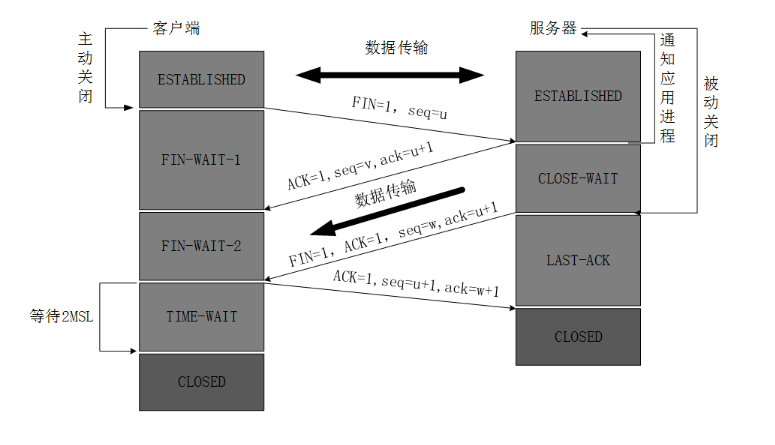
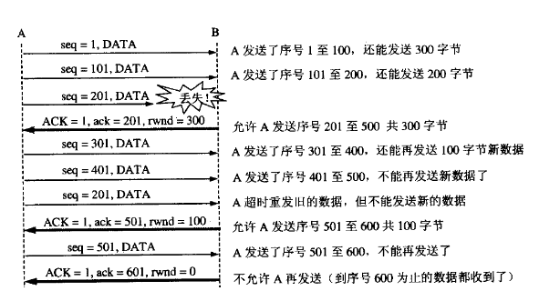

* [1.TCP三次握手和四次挥手](#1-tcp三次握手和四次挥手)
* [2.TCP和UDP的区别](#2-tcp和udp的区别)
* [3.TCP和UPD能否发送0字节的数据包](#3-tcp和udp能否发送0字节的数据包)
* [4.为什么说UDP是面向报文的,而TCP是面向字节流的](#4-为什么说udp是面向报文的,而tcp是面向字节流的)
* [5.TCP流量控制和拥塞控制](#5-tcp流量控制和拥塞控制)

# 1. TCP三次握手和四次挥手
TCP的运输连接管理

　　TCP是面向连接的协议。运输连接是用来传送TCP报文的。TCP运输连接的建立和释放是每一次面向连接的通信中必不可少的过程。因此，运输连接就有三个阶段，即：连接建立、数据传送和连接释放。运输连接的管理就是使运输连接的建立和释放都能正常地进行。

　　在TCP连接建立过程中要解决以下三个问题：

　　（1）要使每一方能够确知对方的存在

　　（2）要允许双方协商一些参数（如最大窗口值、是否使用窗口扩大选项和时间戳选项以及服务质量等）

　　（3）能够对运输实体资源（如缓存大小、连接表中的项目等）进行分配

　　TCP连接的建立采用客户服务器方式。主动发起连接的建立的应用进程叫做客户（client），而被动等待连接建立的应用进程叫做服务器（server）。

TCP的连接建立

　　TCP建立连接的过程叫做握手，握手    
  
  
 

TCP连接释放过程比较复杂，我们仍然结合双方状态的改变来阐明连接释放的过程。

　　数据传输结束后，通信的双方都可以释放连接。现在A和B都处于ESTABLISHED状态。A的应用进程先向其TCP发出连接释放报文段，并停止再发送数据，主动关闭TCP连接。A的应用进程先向其TCP发出连接释放报文段，并停止再发送数据，主动关闭TCP连接。A把连接释放报文段首部的终止控制位FIN置1，其序号seq=u，它等于前面已传送过的数据的最后一个字节的序号加1。这时A进入FIN-WAIT-1（终止等待1）状态，等待B的确定。请注意，TCP规定，FIN报文段即使不携带数据，它也消耗掉一个序号。
  

  
 

　　B收到连接释放报文段后即发出确定，确定号是ack=u+1，而这个报文段自己的序号是v，等于B前面已传送过的数据的最后一个字节的序号加1.然后B就进入CLOSEWAIT（关闭等待）状态。TCP服务器进程这时应通知高层应用进程，因而从A到B这个方向的连接就释放了，这时的TCP连接释放处于半关闭状态，即A已经没有数据要发送了，但 B若发送数据，A仍然要接收。这就是说，从B到A这个方向的连接并未关闭，这个状态可能会持续一段时间。

　　A收到来自B的确认后，就进入FIN-WAIT（终止等待2）状态，等待B发出的连接释放报文段。

　　若B已经没有要向A发送的数据，其应用进程就通知TCP释放连接。这时候B发出的连接释放报文必须使FIN=1.现假定B的序号为w（在半关闭状态B可能又发送一些数据）。B还必须重复上次已发送过的确认号ack=u+1。这时B就进入LAST-ACK（最后确认）状态，等待A的确认。

　　A在收到B的连接释放报文段后，必须对此发出确认。在确认报文段中把ACK置1，确认号ack=w+1，而子集的序号是seq=u+1（根据TCP标准，前面发送过的FIN报文段要消耗一个序号）。然后进入到TIME-WAIT（时间等待）状态。请注意，现在TCP连接还没有释放掉。必须经过时间等待计时器（TIME-WAIT timer）设置的时间2MASL后，ACIA进入到CLOSED状态。时间MSL叫做最长报文段寿命，RFC793建议设为2分钟。但这完全是从 工程上来考虑的，对于现在的网络，MSL=2分钟可能太长了一些。因此TCP允许不同的实现可根据具体情况使用最小的MSL值。因此，从A进入到TIME-WAIT状态后，要经过4分钟才能进入到CLOSED状态，才能开始建立下一个新的连接。当A撤销相应的传输控制块TCB后，就结束了这次的TCP连接。

　　为什么A在TIME-WAIT状态必须等到2MSL的时间？这有两个理由。

答：第一，为了保证A发送的最后一个ACK报文段能够到达B。这个ACK报文段有可能丢失，因而使处在LAST-ACK状态的B收不到对已发送的FIN+ACK报文段的确认。B会超时重传这个FIN+ACK报文段，而A就能在2MSL时间内收到这个重传的FIN+ACK报文段。接着A重传一次确认，重新启动2MSL计时器。最后A和B都正常进入到CLOSED状态。如果A在TIME-WAIT状态不等待一段时间，而是在发送完ACK报文段后立即释放连接，那么就无法收到B重传的FIN+ACK报文段，因而不会再发送一次 确认报文段。这样，B就无法按照正常步骤进入CLOSED状态。

　　第二，防止上一节提到的“已失效的连接请求报文段”出现在本连接中。A在发送完最后一个ACK报文段后，再经过2MSL，就可以使本连接持续的时间内所产生的所有报文段都从网络中 消失。这样就可以使下一个新的连接中不会出现这种旧的连接请求报文段。

　　B只有收到了A发出的确认，就进入CLOSED状态。同样，B在撤销相应的传输控制块TCB后就结束了这次的TCP连接。我们注意到，B结束TCP连接的时间比A早一些。

 

出现太多TIME_WAIT可能导致的后果：  
    在高并发短连接的TCP服务器上，当服务器处理完请求后立刻按照主动正常关闭连接。这个场景下，会出现大量socket处于TIMEWAIT状态。如果客户端的并发量持续很高，此时部分客户端就会显示连接不上。
我来解释下这个场景。主动正常关闭TCP连接，都会出现TIMEWAIT。为什么我们要关注这个高并发短连接呢？有两个方面需要注意：

 ① 高并发可以让服务器在短时间范围内同时占用大量端口，而端口有个0~65535的范围，并不是很多，刨除系统和其他服务要用的，剩下的就更少了。  
 ②在这个场景中，短连接表示“业务处理+传输数据的时间 远远小于 TIMEWAIT超时的时间”的连接。这里有个相对长短的概念，比如，取一个web页面，1秒钟的http短连接处理完业务，在关闭连接之后，这个业务用过的端口会停留在TIMEWAIT状态几分钟，而这几分钟，其他HTTP请求来临的时候是无法占用此端口的。单用这个业务计算服务器的利用率会发现，服务器干正经事的时间和端口（资源）被挂着无法被使用的时间的比例是 1：几百，服务器资源严重浪费。（说个题外话，从这个意义出发来考虑服务器性能调优的话，长连接业务的服务就不需要考虑TIMEWAIT状态。同时，假如你对服务器业务场景非常熟悉，你会发现，在实际业务场景中，一般长连接对应的业务的并发量并不会很高）  
           综合这两个方面，持续的到达一定量的高并发短连接，会使服务器因端口资源不足而拒绝为一部分客户服务。

# 2. TCP和UDP的区别
1.TCP面向连接，UDP是无连接的，即发送数据之前不需要建立连接。  
2.TCP提供可靠的服务。也就是说，通过TCP连接发送的数据，无差错，不丢失，不重复，且按序到达;UDP尽最大努力交付，即不保证可靠交付。  
3.TCP面向字节流，实际上是TCP把数据看成一串无结构的字节流；UDP是面向报文的，UDP没有拥塞控制，因此网络出现拥塞不会使源主机的发送速率降低（对实际应用很有用，如IP电话，实时视频会议等）  
4.每一条TCP连接只能是点到点的；UDP支持一对一，一对多，多对一和多对多的交互通信。  
5.TCP首部开销20字节；UDP首部开销8字节。  
# 3. TCP和UDP能否发送0字节的数据包
1.TCP和UDP都能发送0字节的数据包。  
2.TCP发送0字节的数据包后，接收方调用recv不会接收到该数据包。  
3.UDP发送0字节的数据包后，接收方调用recv能够收到该数据包。  
为什么TCP发送的0字节数据包在接收端无法接收，而UDP却能接收？    
从TCP和UDP的区别可看出，TCP面向连接、字节流，UDP面向无连接、数据包格式。  
在TCP中，接收端接收到0字节时用于表征连接的断开.UDP则无此需求，每一次的sendto都会有一次recvfrom对应。  
TCP发送流程即将数据放进发送缓存即可，0字节的数据发送虽然返回，但并没有数据添加到发送缓存区中，故接收端无法接收。  
而UDP发送函数将数据包放到网卡的链路层发送队列后才返回，在MAC层已经存在一个数据帧，在接收端必然对应recvfrom的返回。  

# 4. 为什么说UDP是面向报文的,而TCP是面向字节流的
1.UDP是面向报文的，发送方的UDP对应用层交下来的报文，不合并，不拆分，只是在其上面加上首部后就交给了下面的网络层，也就是说无论应用层交给UDP多长的报文，它统统发送，一次发送一个。而对接收方，接到后直接去除首部，交给上面的的应用层就完成任务了。因此，它需要应用层控制报文的大小。  
2.TCP是面向字节流的，它把上面应用层交下来的数据看成是无结构的字节流来发送，可以想象成流水形式的，发送方TCP会将数据放入“蓄水池”(缓存区)，等到可以发送的时候就发送，不能发送就等着，TCP会根据当前网络的拥塞状态来确定每个报文段的大小。  

# 5. TCP流量控制和拥塞控制
## TCP的流量控制
　　所谓的流量控制就是让发送方的发送速率不要太快，让接收方来得及接收。利用滑动窗口机制可以很方便的在TCP连接上实现对发送方的流量控制。TCP的窗口单位是字节，不是报文段，发送方的发送窗口不能超过接收方给出的接收窗口的数值。  
    
  
 
　　如图所示，说明了利用可变窗口大小进行流量控制。设主机A向B发送数据。双方确定的窗口值是400，再设每一个报文段为100字节长，序号的初始值为seq=1，图中的箭头上面大写ACK，表示首部中的确认位为ACK，小写ack表示确认字段的值。    
　　接收方的主机B进行了三次流量控制。第一次把窗口设置为rwind=300，第二次减少到rwind=100，最后减到rwind=0，即不允许发送方再发送数据了。这种使发送方暂停发送的状态将持续到主机B重新发送出一个新的窗口值为止。  
　　假如，B向A发送了零窗口的报文段后不久，B的接收缓存又有了一些存储空间，于是B向A发送了rwind=400的报文段，然而这个报文段在传送中丢失了。A一直等待收到B发送的非零窗口的通知，而B也一直等待A发送的数据。这样就死锁了。为了解决这种死锁，TCP为每个连接设有一个持续计时器。只要TCP连接的一方收到对方的零窗口通知，就启动持续计时器，若持续计时器设置的时间到期了，就发送一个零窗口探测报文段（仅携带1字节的数据），而对方就在确认这个探测报文段时给出了现在的窗口值。  

## TCP报文段发送时机的选择
　　TCP报文段发送时机主要有以下几种选择途径。  
　　1）TCP维持一个变量，它等于最大报文段长度MSS，只要缓存中存放的数据达到MSS字节就组成一个TCP报文段发送出去。  
　　2）由发送方的应用程序指明要求发送报文段，即TCP支持的推送操作。  
　　3）是发送方的一个计时期限到了，这时候就把当前已有的缓存数据装入报文段发送出去。  
## Nagle算法
　　若发送应用进程把要发送的数据逐个字节地送到TCP的发送缓存，则发送方就把第一个数据字节先发送出去，把后面到达的数据字节都缓存起来。当发送方接收对第一个数据字符的确认后，再把发送缓存中的所有数据组装成一个报文段再发送出去，同时继续对随后到达的数据进行缓存。只有在收到对前一个报文段的确认后才继续发送下一个报文段。当数据到达较快而网络速率较慢时，用这样的方法可明显地减少所用的网络带宽。Nagle算法还规定：当到达的数据已达到发送窗口大小的一半或已达到报文段的最大长度时，就立即发送一个报文段。  
## 糊涂窗口综合征
　　TCP接收方的缓存已满，而交互的应用进程一次只从接收缓存中读取1字节（这样就使接收缓存空间仅腾出1字节），然后向发送方发送确认，并把窗口设置为1字节（但发送的的数据报为40字节的话），接收，发送方又发来1字节的数据（发送方的IP数据报是41字节）。接收方发回确认，仍然将窗口设置为1.这样，网络的效率很低。要解决这个问题，可让接收方等待一段时间，使得或者接收缓存已有足够空间容纳一个最长的报文段，或者等到接收方缓存已有一半空闲的空间。只要出现这两种情况，接收方就发回确认报文，并向发送方通知当前的窗口大小，此外，发送方也不要发送太小的报文段，而是把数据积累成足够大的报文段，或达到接收方缓存的空间的一半大小。
## TCP的拥塞控制
1.拥塞：即对资源的需求超过了可用的资源。若网络中许多资源同时供应不足，网络的性能就要明显变坏，整个网络的吞吐量随之负荷的增大而下降。  
　　拥塞控制：防止过多的数据注入到网络中，这样可以使网络中的路由器或链路不致过载。拥塞控制所要做的都有一个前提：网络能够承受现有的网络负荷。拥塞控制是一个全局性的过程，涉及到所有的主机、路由器，以及与降低网络传输性能有关的所有因素。  
　　流量控制：指点对点通信的控制，是端到端的问题。流量控制所要做的是抑制发送端发送数据的速率，以便使接收端来得及接收。  
　　拥塞控制的代价：需要获得网络内部流量分布信息。在实施拥塞控制之前，还需要在结点之间交换信息和各种命令，以便选择控制的策略和实施控制。这样就产生了额外的开销。拥塞控制还需要将一些资源分配给各个用户单独使用，使得网络资源不能更好的实现共享。    
2.几种拥塞控制的方法
　　慢开始、拥塞避免、快重传和快恢复
2.1慢开始和拥塞避免

　　
  
  
